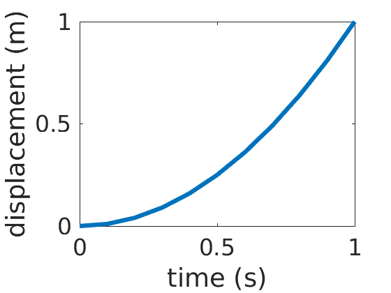
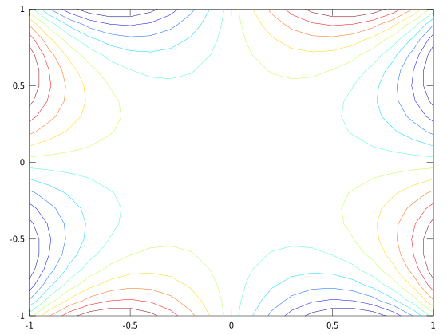
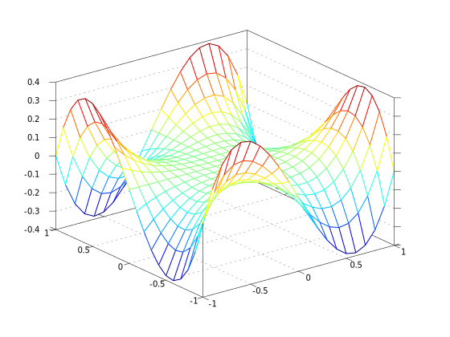
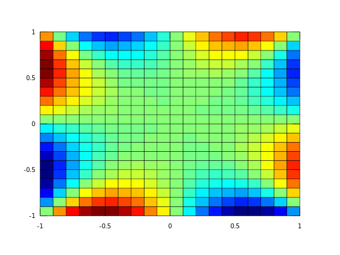

# Matlab basic use
## 1- the environment, path and working directory

Matlab environment can be called by:
1. Starting the matlab executable (the gui)
2. Starting a jupyter notebook with Matlab kernel
3. Starting matlab with command-line interface (no gui)

The main requirement is that matlab kernel (main matlab program) is running and accepting commands

When you start, you can call matlab built-in functions or anything you write that is in your `MATLABPATH` or working directory (`pwd`)


```matlab
path
```

    MATLABPATH
    
    	/usr/local/lib/python2.7/dist-packages/matlab_kernel/toolbox
    	/usr/local/lib/python2.7/dist-packages/pymatbridge/matlab
    	/usr/local/lib/python2.7/dist-packages/pymatbridge/matlab/usrprog
    	/usr/local/lib/python2.7/dist-packages/pymatbridge/matlab/util
    	/usr/local/lib/python2.7/dist-packages/pymatbridge/matlab/util/json_v0.2.2
    	/usr/local/lib/python2.7/dist-packages/pymatbridge/matlab/util/json_v0.2.2/json
    	/usr/local/lib/python2.7/dist-packages/pymatbridge/matlab/util/json_v0.2.2/json/java
    	/usr/local/lib/python2.7/dist-packages/pymatbridge/matlab/util/json_v0.2.2/test
    	/home/ryan/Documents/MATLAB
    	/usr/local/MATLAB/R2016a/toolbox/matlab/strfun
    	/usr/local/MATLAB/R2016a/toolbox/matlab/datatypes
    	/usr/local/MATLAB/R2016a/toolbox/matlab/elfun
    	/usr/local/MATLAB/R2016a/toolbox/matlab/ops
    	/usr/local/MATLAB/R2016a/toolbox/matlab/timefun
    	/usr/local/MATLAB/R2016a/toolbox/matlab/elmat
    	/usr/local/MATLAB/R2016a/toolbox/matlab/datafun
    	/usr/local/MATLAB/R2016a/toolbox/matlab/iofun
    	/usr/local/MATLAB/R2016a/toolbox/matlab/mvm
    	/usr/local/MATLAB/R2016a/toolbox/matlab/randfun
    	/usr/local/MATLAB/R2016a/toolbox/matlab/funfun
    	/usr/local/MATLAB/R2016a/toolbox/matlab/general
    	/usr/local/MATLAB/R2016a/toolbox/matlab/polyfun
    	/usr/local/MATLAB/R2016a/toolbox/matlab/matfun
    	/usr/local/MATLAB/R2016a/toolbox/matlab/lang
    	/usr/local/MATLAB/R2016a/toolbox/matlab/specfun
    	/usr/local/MATLAB/R2016a/toolbox/matlab/sparfun
    	/usr/local/MATLAB/R2016a/toolbox/matlab/images
    	/usr/local/MATLAB/R2016a/toolbox/matlab/testframework/performance
    	/usr/local/MATLAB/R2016a/toolbox/matlab/testframework/parallel
    	/usr/local/MATLAB/R2016a/toolbox/matlab/optimfun
    	/usr/local/MATLAB/R2016a/toolbox/matlab/testframework/ext
    	/usr/local/MATLAB/R2016a/toolbox/matlab/guide
    	/usr/local/MATLAB/R2016a/toolbox/matlab/testframework/measurement
    	/usr/local/MATLAB/R2016a/toolbox/matlab/icons
    	/usr/local/MATLAB/R2016a/toolbox/matlab/demos
    	/usr/local/MATLAB/R2016a/toolbox/matlab/helptools
    	/usr/local/MATLAB/R2016a/toolbox/matlab/winfun
    	/usr/local/MATLAB/R2016a/toolbox/matlab/winfun/NET
    	/usr/local/MATLAB/R2016a/toolbox/matlab/datamanager
    	/usr/local/MATLAB/R2016a/toolbox/matlab/verctrl
    	/usr/local/MATLAB/R2016a/toolbox/matlab/graph2d
    	/usr/local/MATLAB/R2016a/toolbox/matlab/graph3d
    	/usr/local/MATLAB/R2016a/toolbox/matlab/graphics
    	/usr/local/MATLAB/R2016a/toolbox/matlab/graphics/obsolete
    	/usr/local/MATLAB/R2016a/toolbox/matlab/plottools
    	/usr/local/MATLAB/R2016a/toolbox/matlab/scribe
    	/usr/local/MATLAB/R2016a/toolbox/matlab/scribe/obsolete
    	/usr/local/MATLAB/R2016a/toolbox/matlab/specgraph
    	/usr/local/MATLAB/R2016a/toolbox/matlab/uitools
    	/usr/local/MATLAB/R2016a/toolbox/matlab/uitools/obsolete
    	/usr/local/MATLAB/R2016a/toolbox/hdlcoder/matlabhdlcoder/matlabhdlcoder
    	/usr/local/MATLAB/R2016a/toolbox/hdlcoder/matlabhdlcoder
    	/usr/local/MATLAB/R2016a/toolbox/matlab/testframework/core
    	/usr/local/MATLAB/R2016a/toolbox/matlab/testframework/obsolete
    	/usr/local/MATLAB/R2016a/toolbox/matlab/hardware/stubs
    	/usr/local/MATLAB/R2016a/toolbox/local
    	/usr/local/MATLAB/R2016a/toolbox/matlab/datastoreio
    	/usr/local/MATLAB/R2016a/toolbox/matlab/codetools
    	/usr/local/MATLAB/R2016a/toolbox/matlab/codetools/embeddedoutputs
    	/usr/local/MATLAB/R2016a/toolbox/matlab/graphfun
    	/usr/local/MATLAB/R2016a/toolbox/matlab/depfun
    	/usr/local/MATLAB/R2016a/toolbox/matlab/mapreduceio
    	/usr/local/MATLAB/R2016a/toolbox/matlab/findfiles
    	/usr/local/MATLAB/R2016a/toolbox/rtw/targets/asap2/asap2/dataclasses
    	/usr/local/MATLAB/R2016a/toolbox/rtw/targets/asap2/asap2
    	/usr/local/MATLAB/R2016a/toolbox/rtw/targets/asap2/asap2/user
    	/usr/local/MATLAB/R2016a/toolbox/rtw/targets/common/can/blocks/dataclasses
    	/usr/local/MATLAB/R2016a/toolbox/rtw/targets/common/can/blocks
    	/usr/local/MATLAB/R2016a/toolbox/rtw/targets/common/can/blocks/tlc_c
    	/usr/local/MATLAB/R2016a/toolbox/rtw/targets/common/tgtcommon
    	/usr/local/MATLAB/R2016a/toolbox/coder/simulinkcoder/cgv/API
    	/usr/local/MATLAB/R2016a/toolbox/rtw/rtw/misra
    	/usr/local/MATLAB/R2016a/toolbox/coder/simulinkcoder
    	/usr/local/MATLAB/R2016a/toolbox/coder/simulinkcoder/templates
    	/usr/local/MATLAB/R2016a/toolbox/coder/simulinkcoder/targets
    	/usr/local/MATLAB/R2016a/toolbox/rtw/targets/pil
    	/usr/local/MATLAB/R2016a/toolbox/rtw/targets/AUTOSAR/AUTOSAR/dataclasses
    	/usr/local/MATLAB/R2016a/toolbox/rtw/targets/AUTOSAR/AUTOSAR
    	/usr/local/MATLAB/R2016a/toolbox/rtw/accel
    	/usr/local/MATLAB/R2016a/toolbox/coder/simulinkcoder_core
    	/usr/local/MATLAB/R2016a/toolbox/rtw/rtwdemos
    	/usr/local/MATLAB/R2016a/toolbox/rtw/rtwdemos/rsimdemos
    	/usr/local/MATLAB/R2016a/toolbox/simulink/simdemos/simfeatures
    	/usr/local/MATLAB/R2016a/toolbox/simulink/simdemos/simfeatures/modelreference
    	/usr/local/MATLAB/R2016a/toolbox/simulink/simdemos/simfeatures/datadictionary
    	/usr/local/MATLAB/R2016a/toolbox/simulink/sysarch/sysarch
    	/usr/local/MATLAB/R2016a/toolbox/simulink/simdemos/simgeneral
    	/usr/local/MATLAB/R2016a/toolbox/slde/examples
    	/usr/local/MATLAB/R2016a/toolbox/coder/advisor
    	/usr/local/MATLAB/R2016a/toolbox/simulink/simulink/modeladvisor
    	/usr/local/MATLAB/R2016a/toolbox/simulink/simulink/modeladvisor/fixpt
    	/usr/local/MATLAB/R2016a/toolbox/simulink/simdemos/automotive/fuelsys
    	/usr/local/MATLAB/R2016a/toolbox/simulink/components
    	/usr/local/MATLAB/R2016a/toolbox/simulink/dee
    	/usr/local/MATLAB/R2016a/toolbox/simulink/simdemos/aerospace
    	/usr/local/MATLAB/R2016a/toolbox/simulinktest/core/simharness/simharness
    	/usr/local/MATLAB/R2016a/toolbox/simulink/simulink/frameedit
    	/usr/local/MATLAB/R2016a/toolbox/simulink/simdemos/industrial
    	/usr/local/MATLAB/R2016a/toolbox/simulink/simdemos/automotive
    	/usr/local/MATLAB/R2016a/toolbox/simulink/blocks/library
    	/usr/local/MATLAB/R2016a/toolbox/simulink/blocks/library/simulinkcoder
    	/usr/local/MATLAB/R2016a/toolbox/simulink/blocks/obsolete
    	/usr/local/MATLAB/R2016a/toolbox/simulink/simdemos/dataclasses
    	/usr/local/MATLAB/R2016a/toolbox/simulink/simdemos
    	/usr/local/MATLAB/R2016a/toolbox/simulink/blocks
    	/usr/local/MATLAB/R2016a/toolbox/simulink/simulink/dataclasses
    	/usr/local/MATLAB/R2016a/toolbox/simulink/simulink
    	/usr/local/MATLAB/R2016a/toolbox/simulink/simulink/MPlayIO
    	/usr/local/MATLAB/R2016a/toolbox/simulink/simulink/dataobjectwizard
    	/usr/local/MATLAB/R2016a/toolbox/simulink/simulink/slresolve
    	/usr/local/MATLAB/R2016a/toolbox/simulink/simulink/units
    	/usr/local/MATLAB/R2016a/toolbox/simulink/simulink/resources
    	/usr/local/MATLAB/R2016a/toolbox/simulink/sdi
    	/usr/local/MATLAB/R2016a/toolbox/simulink/simulink/core_templates
    	/usr/local/MATLAB/R2016a/toolbox/simulinktest/core/testsequence/testsequence
    	/usr/local/MATLAB/R2016a/toolbox/simulink/simdemos/automotive/powerwindow
    	/usr/local/MATLAB/R2016a/toolbox/simulink/sldependency
    	/usr/local/MATLAB/R2016a/toolbox/simulink/hmi
    	/usr/local/MATLAB/R2016a/toolbox/coder/objectives
    	/usr/local/MATLAB/R2016a/toolbox/slde/slde
    	/usr/local/MATLAB/R2016a/toolbox/slde/slde/resources
    	/usr/local/MATLAB/R2016a/toolbox/stateflow/stateflow
    	/usr/local/MATLAB/R2016a/toolbox/stateflow/coder
    	/usr/local/MATLAB/R2016a/toolbox/stateflow/sfdemos
    	/usr/local/MATLAB/R2016a/toolbox/stateflow/sftemplates
    	/usr/local/MATLAB/R2016a/toolbox/shared/testmeaslib/general
    	/usr/local/MATLAB/R2016a/toolbox/simulink/blocks/sb2sl
    	/usr/local/MATLAB/R2016a/toolbox/physmod/powersys/DR/DR
    	/usr/local/MATLAB/R2016a/toolbox/shared/reqmgt
    	/usr/local/MATLAB/R2016a/toolbox/shared/reqmgt/mmutils
    	/usr/local/MATLAB/R2016a/toolbox/shared/controllib/graphics
    	/usr/local/MATLAB/R2016a/toolbox/shared/controllib/graphics/utils
    	/usr/local/MATLAB/R2016a/toolbox/shared/controllib/graphics/plotoptions
    	/usr/local/MATLAB/R2016a/toolbox/simulink/sledittimecheck
    	/usr/local/MATLAB/R2016a/toolbox/hdlcoder/slhdltemplates
    	/usr/local/MATLAB/R2016a/toolbox/distcomp
    	/usr/local/MATLAB/R2016a/toolbox/distcomp/distcomp
    	/usr/local/MATLAB/R2016a/toolbox/distcomp/user
    	/usr/local/MATLAB/R2016a/toolbox/distcomp/mpi
    	/usr/local/MATLAB/R2016a/toolbox/distcomp/parallel
    	/usr/local/MATLAB/R2016a/toolbox/distcomp/parallel/util
    	/usr/local/MATLAB/R2016a/toolbox/distcomp/lang
    	/usr/local/MATLAB/R2016a/toolbox/distcomp/cluster
    	/usr/local/MATLAB/R2016a/toolbox/distcomp/gpu
    	/usr/local/MATLAB/R2016a/toolbox/distcomp/array
    	/usr/local/MATLAB/R2016a/toolbox/target/codertarget
    	/usr/local/MATLAB/R2016a/toolbox/target/codertarget/rtw
    	/usr/local/MATLAB/R2016a/toolbox/target/codertarget/matlabcoder
    	/usr/local/MATLAB/R2016a/toolbox/physmod/simscape/simscapedemos
    	/usr/local/MATLAB/R2016a/toolbox/comm/templates
    	/usr/local/MATLAB/R2016a/toolbox/shared/simulink
    	/usr/local/MATLAB/R2016a/toolbox/hdlcoder/hdlcoderdemos
    	/usr/local/MATLAB/R2016a/toolbox/hdlcoder/hdlcoderdemos/matlabhdlcoderdemos
    	/usr/local/MATLAB/R2016a/toolbox/target/extensions/processor/tic5000/tic5000demos
    	/usr/local/MATLAB/R2016a/toolbox/physmod/common/gl/sli/m
    	/usr/local/MATLAB/R2016a/toolbox/shared/system/simulink
    	/usr/local/MATLAB/R2016a/toolbox/images/colorspaces
    	/usr/local/MATLAB/R2016a/toolbox/images/images
    	/usr/local/MATLAB/R2016a/toolbox/images/imdata
    	/usr/local/MATLAB/R2016a/toolbox/images/imuitools
    	/usr/local/MATLAB/R2016a/toolbox/images/iptformats
    	/usr/local/MATLAB/R2016a/toolbox/images/iptutils
    	/usr/local/MATLAB/R2016a/toolbox/target/extensions/processor/tic6000
    	/usr/local/MATLAB/R2016a/toolbox/target/extensions/processor/tic6000/rtw
    	/usr/local/MATLAB/R2016a/toolbox/target/extensions/processor/tic6000/tfl
    	/usr/local/MATLAB/R2016a/toolbox/target/extensions/processor/tic6000/utils
    	/usr/local/MATLAB/R2016a/toolbox/target/extensions/processor/tic6000/blks/sysobj_mex
    	/usr/local/MATLAB/R2016a/toolbox/target/extensions/processor/tic6000/blks/mex
    	/usr/local/MATLAB/R2016a/toolbox/distcomp/pctdemos
    	/usr/local/MATLAB/R2016a/toolbox/matlab/appdesigner/appdesigner
    	/usr/local/MATLAB/R2016a/toolbox/shared/mlreportgen/ppt
    	/usr/local/MATLAB/R2016a/toolbox/shared/mlreportgen/ppt/ppt
    	/usr/local/MATLAB/R2016a/toolbox/shared/mlreportgen/ppt/ppt/help
    	/usr/local/MATLAB/R2016a/toolbox/coder/matlabcoder
    	/usr/local/MATLAB/R2016a/toolbox/coder/matlabcoder/templates
    	/usr/local/MATLAB/R2016a/toolbox/dsp/templates
    	/usr/local/MATLAB/R2016a/toolbox/globaloptim
    	/usr/local/MATLAB/R2016a/toolbox/globaloptim/globaloptim
    	/usr/local/MATLAB/R2016a/toolbox/shared/appdes/services
    	/usr/local/MATLAB/R2016a/toolbox/coder/emlcodermex
    	/usr/local/MATLAB/R2016a/toolbox/physmod/powersys/powerdemo/power_electronics
    	/usr/local/MATLAB/R2016a/toolbox/pde/pdedemos
    	/usr/local/MATLAB/R2016a/toolbox/slvnv/slvnvdemos
    	/usr/local/MATLAB/R2016a/toolbox/sl_pir_cap
    	/usr/local/MATLAB/R2016a/toolbox/target
    	/usr/local/MATLAB/R2016a/toolbox/target/foundation
    	/usr/local/MATLAB/R2016a/toolbox/target/foundation/utils
    	/usr/local/MATLAB/R2016a/toolbox/target/foundation/utils/resource_config
    	/usr/local/MATLAB/R2016a/toolbox/target/foundation/blks
    	/usr/local/MATLAB/R2016a/toolbox/target/foundation/blks/mex
    	/usr/local/MATLAB/R2016a/toolbox/target/foundation/blks/masks
    	/usr/local/MATLAB/R2016a/toolbox/target/extensions/processor/shared
    	/usr/local/MATLAB/R2016a/toolbox/target/extensions/processor/shared/ti
    	/usr/local/MATLAB/R2016a/toolbox/target/extensions/processor/shared/ti/mdlinfo
    	/usr/local/MATLAB/R2016a/toolbox/target/extensions/processor/shared/ti/utils
    	/usr/local/MATLAB/R2016a/toolbox/target/extensions/processor/shared/ti/blks
    	/usr/local/MATLAB/R2016a/toolbox/target/extensions/processor/shared/ti/blks/mex
    	/usr/local/MATLAB/R2016a/toolbox/target/extensions/processor/shared/ti/blks/masks
    	/usr/local/MATLAB/R2016a/toolbox/target/extensions/processor/ARM/tfl
    	/usr/local/MATLAB/R2016a/toolbox/shared/etargets/etargets
    	/usr/local/MATLAB/R2016a/toolbox/shared/etargets/etargets/demoutils
    	/usr/local/MATLAB/R2016a/toolbox/optim/optim
    	/usr/local/MATLAB/R2016a/toolbox/optim
    	/usr/local/MATLAB/R2016a/toolbox/physmod/simscape/advisor/m
    	/usr/local/MATLAB/R2016a/toolbox/target/targetdemos
    	/usr/local/MATLAB/R2016a/toolbox/shared/hadoopserializer
    	/usr/local/MATLAB/R2016a/toolbox/matlab/external/engines/engine_api
    	/usr/local/MATLAB/R2016a/toolbox/shared/siglib
    	/usr/local/MATLAB/R2016a/toolbox/simulink/simulink/performance
    	/usr/local/MATLAB/R2016a/toolbox/simulink/simulink/performance/performancea
    	/usr/local/MATLAB/R2016a/toolbox/simevents/examples
    	/usr/local/MATLAB/R2016a/toolbox/shared/hdlshared
    	/usr/local/MATLAB/R2016a/toolbox/physmod/sm/local/m
    	/usr/local/MATLAB/R2016a/toolbox/matlab/uicomponents/uicomponents
    	/usr/local/MATLAB/R2016a/toolbox/matlab/uicomponents/uicomponents/pending
    	/usr/local/MATLAB/R2016a/toolbox/matlab/uicomponents/uicomponents/graphics
    	/usr/local/MATLAB/R2016a/toolbox/fixedpoint/fixedpointconverter
    	/usr/local/MATLAB/R2016a/toolbox/physmod/powersys/drives/drivesdemo
    	/usr/local/MATLAB/R2016a/toolbox/physmod/simscape/library/m
    	/usr/local/MATLAB/R2016a/toolbox/shared/sdi
    	/usr/local/MATLAB/R2016a/toolbox/shared/asynciolib
    	/usr/local/MATLAB/R2016a/toolbox/shared/cmlink/api
    	/usr/local/MATLAB/R2016a/toolbox/matlab/toolboxmanagement/matlab_api
    	/usr/local/MATLAB/R2016a/toolbox/mpc/mpcdemos
    	/usr/local/MATLAB/R2016a/toolbox/distcomp/mapreduce
    	/usr/local/MATLAB/R2016a/toolbox/matlab/networklib
    	/usr/local/MATLAB/R2016a/toolbox/dsp/dspdemos
    	/usr/local/MATLAB/R2016a/toolbox/shared/testmeaslib/simulink
    	/usr/local/MATLAB/R2016a/toolbox/shared/controllib/general
    	/usr/local/MATLAB/R2016a/toolbox/shared/imaqlib
    	/usr/local/MATLAB/R2016a/toolbox/physmod/equation_language/equation_language
    	/usr/local/MATLAB/R2016a/toolbox/simulink/slmetrics
    	/usr/local/MATLAB/R2016a/toolbox/vision/vision
    	/usr/local/MATLAB/R2016a/toolbox/vision/visiondata
    	/usr/local/MATLAB/R2016a/toolbox/vision/visionutilities
    	/usr/local/MATLAB/R2016a/toolbox/vision/visionutilities/visioninit
    	/usr/local/MATLAB/R2016a/toolbox/vision/visionutilities/visionmex
    	/usr/local/MATLAB/R2016a/toolbox/physmod/simscape/foundation/simscape
    	/usr/local/MATLAB/R2016a/toolbox/shared/system/sfun
    	/usr/local/MATLAB/R2016a/toolbox/matlab/toolbox_packaging
    	/usr/local/MATLAB/R2016a/toolbox/simulink/simulink_data_dictionary/sldd
    	/usr/local/MATLAB/R2016a/toolbox/shared/pdelib
    	/usr/local/MATLAB/R2016a/toolbox/compiler_sdk/java
    	/usr/local/MATLAB/R2016a/toolbox/simulink/sta/scenarioconnector
    	/usr/local/MATLAB/R2016a/toolbox/simulink/sta/scenarioconnector/ui
    	/usr/local/MATLAB/R2016a/toolbox/simulink/sta/scenarioconnector/ui/toolstrip/modelsection
    	/usr/local/MATLAB/R2016a/toolbox/simulink/sta/scenarioconnector/ui/toolstrip/filesection
    	/usr/local/MATLAB/R2016a/toolbox/simulink/sta/editor/ui
    	/usr/local/MATLAB/R2016a/toolbox/simulink/sta/ui
    	/usr/local/MATLAB/R2016a/toolbox/simulink/sta/ui/comparisontool
    	/usr/local/MATLAB/R2016a/toolbox/simulink/sta/ui/mapping
    	/usr/local/MATLAB/R2016a/toolbox/simulink/sta/ui/mapping/callbacks
    	/usr/local/MATLAB/R2016a/toolbox/simulink/sta/ui/mapping/util
    	/usr/local/MATLAB/R2016a/toolbox/simulink/sta/ui/toolstrip
    	/usr/local/MATLAB/R2016a/toolbox/simulink/sta/ui/toolstrip/open/streaming
    	/usr/local/MATLAB/R2016a/toolbox/simulink/sta/ui/toolstrip/help
    	/usr/local/MATLAB/R2016a/toolbox/simulink/sta/ui/toolstrip/open
    	/usr/local/MATLAB/R2016a/toolbox/simulink/sta/ui/toolstrip/session
    	/usr/local/MATLAB/R2016a/toolbox/simulink/sta/ui/toolstrip/report
    	/usr/local/MATLAB/R2016a/toolbox/globaloptim/globaloptimdemos
    	/usr/local/MATLAB/R2016a/toolbox/econ/econ
    	/usr/local/MATLAB/R2016a/toolbox/physmod/common/dataservices/sli/m
    	/usr/local/MATLAB/R2016a/toolbox/shared/sl_async_streaming
    	/usr/local/MATLAB/R2016a/toolbox/idelink/extensions/ticcs
    	/usr/local/MATLAB/R2016a/toolbox/idelink/extensions/ticcs/ccsblks
    	/usr/local/MATLAB/R2016a/toolbox/idelink/extensions/ticcs/ccslinkblks
    	/usr/local/MATLAB/R2016a/toolbox/idelink/extensions/ticcs/ccslinkblks/rtdxsimblks
    	/usr/local/MATLAB/R2016a/toolbox/idelink/extensions/ticcs/mdlinfo
    	/usr/local/MATLAB/R2016a/toolbox/idelink/extensions/ticcs/tfl
    	/usr/local/MATLAB/R2016a/toolbox/idelink/extensions/ticcs/util
    	/usr/local/MATLAB/R2016a/toolbox/idelink/extensions/ticcs/rtw
    	/usr/local/MATLAB/R2016a/toolbox/idelink/extensions/ticcs/envChecker
    	/usr/local/MATLAB/R2016a/toolbox/idelink/foundation/pjtgenerator
    	/usr/local/MATLAB/R2016a/toolbox/idelink/foundation/pjtgenerator/rtw
    	/usr/local/MATLAB/R2016a/toolbox/idelink/foundation/pjtgenerator/tgtpref2
    	/usr/local/MATLAB/R2016a/toolbox/idelink/foundation/pjtgenerator/profiler
    	/usr/local/MATLAB/R2016a/toolbox/idelink/foundation/pjtgenerator/mdlinfo
    	/usr/local/MATLAB/R2016a/toolbox/idelink/foundation/pjtgenerator/blks
    	/usr/local/MATLAB/R2016a/toolbox/idelink/foundation/pjtgenerator/blks/masks
    	/usr/local/MATLAB/R2016a/toolbox/idelink/foundation/pjtgenerator/blks/tlc_c
    	/usr/local/MATLAB/R2016a/toolbox/physmod/simscape/engine/core/m
    	/usr/local/MATLAB/R2016a/toolbox/shared/system/coder
    	/usr/local/MATLAB/R2016a/toolbox/wavelet/wavelet
    	/usr/local/MATLAB/R2016a/toolbox/wavelet/wmultisig1d
    	/usr/local/MATLAB/R2016a/toolbox/wavelet/compression
    	/usr/local/MATLAB/R2016a/toolbox/hdlcoder/hdlcommon
    	/usr/local/MATLAB/R2016a/toolbox/hdlcoder/hdlcommon/modelcheckeradvisor
    	/usr/local/MATLAB/R2016a/toolbox/physmod/powersys/library
    	/usr/local/MATLAB/R2016a/toolbox/slvnv/rmidemos
    	/usr/local/MATLAB/R2016a/toolbox/shared/eda/board
    	/usr/local/MATLAB/R2016a/toolbox/hdlcoder/hdllib/sl_lib
    	/usr/local/MATLAB/R2016a/toolbox/bioinfo/bioinfodata
    	/usr/local/MATLAB/R2016a/toolbox/shared/coder/coder
    	/usr/local/MATLAB/R2016a/toolbox/shared/dsp/visionhdl/simulink/dsp
    	/usr/local/MATLAB/R2016a/toolbox/shared/polyspace
    	/usr/local/MATLAB/R2016a/toolbox/robust/rctdemos
    	/usr/local/MATLAB/R2016a/toolbox/simulink/sltemplate
    	/usr/local/MATLAB/R2016a/toolbox/physmod/common/dataservices/core/m
    	/usr/local/MATLAB/R2016a/toolbox/matlab/system/editor
    	/usr/local/MATLAB/R2016a/toolbox/hdlcoder/hdlcoder
    	/usr/local/MATLAB/R2016a/toolbox/hdlcoder/hdlcoder/hdlwa
    	/usr/local/MATLAB/R2016a/toolbox/rtw/targets/ecoder/ecoderdemos/dataclasses
    	/usr/local/MATLAB/R2016a/toolbox/rtw/targets/ecoder/ecoderdemos
    	/usr/local/MATLAB/R2016a/toolbox/signal/signal
    	/usr/local/MATLAB/R2016a/toolbox/signal/sigtools
    	/usr/local/MATLAB/R2016a/toolbox/signal/sptoolgui
    	/usr/local/MATLAB/R2016a/toolbox/compiler/mlhadoop
    	/usr/local/MATLAB/R2016a/toolbox/physmod/sm/smdemos
    	/usr/local/MATLAB/R2016a/toolbox/physmod/sm/smdemos/images
    	/usr/local/MATLAB/R2016a/toolbox/physmod/sm/smdemos/wing_landing_gear
    	/usr/local/MATLAB/R2016a/toolbox/physmod/sm/smdemos/wing_landing_gear/images
    	/usr/local/MATLAB/R2016a/toolbox/physmod/sm/smdemos/cart_double_pendulum
    	/usr/local/MATLAB/R2016a/toolbox/physmod/sm/smdemos/cart_double_pendulum/images
    	/usr/local/MATLAB/R2016a/toolbox/physmod/sm/smdemos/stewart_platform
    	/usr/local/MATLAB/R2016a/toolbox/physmod/sm/smdemos/stewart_platform/images
    	/usr/local/MATLAB/R2016a/toolbox/physmod/sm/smdemos/double_crank_aiming
    	/usr/local/MATLAB/R2016a/toolbox/physmod/sm/smdemos/double_crank_aiming/images
    	/usr/local/MATLAB/R2016a/toolbox/physmod/sm/smdemos/bread_slicer
    	/usr/local/MATLAB/R2016a/toolbox/physmod/sm/smdemos/bread_slicer/images
    	/usr/local/MATLAB/R2016a/toolbox/physmod/sm/smdemos/import/stewart_platform
    	/usr/local/MATLAB/R2016a/toolbox/physmod/sm/smdemos/import/four_bar
    	/usr/local/MATLAB/R2016a/toolbox/physmod/sm/smdemos/radial_engine
    	/usr/local/MATLAB/R2016a/toolbox/physmod/sm/smdemos/radial_engine/images
    	/usr/local/MATLAB/R2016a/toolbox/physmod/sm/smdemos/double_wishbone_suspension
    	/usr/local/MATLAB/R2016a/toolbox/physmod/sm/smdemos/double_wishbone_suspension/images
    	/usr/local/MATLAB/R2016a/toolbox/physmod/sm/smdemos/import/robot
    	/usr/local/MATLAB/R2016a/toolbox/physmod/sm/smdemos/cardan_gear
    	/usr/local/MATLAB/R2016a/toolbox/physmod/sm/smdemos/cardan_gear/images
    	/usr/local/MATLAB/R2016a/toolbox/physmod/sm/smdemos/windshield_wiper
    	/usr/local/MATLAB/R2016a/toolbox/physmod/sm/smdemos/windshield_wiper/images
    	/usr/local/MATLAB/R2016a/toolbox/physmod/sm/smdemos/backhoe
    	/usr/local/MATLAB/R2016a/toolbox/physmod/sm/smdemos/robotic_wrist
    	/usr/local/MATLAB/R2016a/toolbox/physmod/sm/smdemos/carousel
    	/usr/local/MATLAB/R2016a/toolbox/physmod/sm/smdemos/welding_robot
    	/usr/local/MATLAB/R2016a/toolbox/physmod/sm/smdemos/import/robot_stepfiles
    	/usr/local/MATLAB/R2016a/toolbox/physmod/sm/smdemos/potters_wheel
    	/usr/local/MATLAB/R2016a/toolbox/physmod/sm/smdemos/linear_actuator
    	/usr/local/MATLAB/R2016a/toolbox/physmod/sm/smdemos/pto_shaft
    	/usr/local/MATLAB/R2016a/toolbox/physmod/sm/smdemos/cam_flapping_wing
    	/usr/local/MATLAB/R2016a/toolbox/simulink/fixedandfloat/fxpdemos
    	/usr/local/MATLAB/R2016a/toolbox/vision/visiondemos
    	/usr/local/MATLAB/R2016a/toolbox/nnet/nndemos
    	/usr/local/MATLAB/R2016a/toolbox/nnet/nndemos/nndatasets
    	/usr/local/MATLAB/R2016a/toolbox/shared/hwconnectinstaller
    	/usr/local/MATLAB/R2016a/help/toolbox/comm/examples
    	/usr/local/MATLAB/R2016a/toolbox/bioinfo/bioinfo
    	/usr/local/MATLAB/R2016a/toolbox/bioinfo/biolearning
    	/usr/local/MATLAB/R2016a/toolbox/bioinfo/microarray
    	/usr/local/MATLAB/R2016a/toolbox/bioinfo/mass_spec
    	/usr/local/MATLAB/R2016a/toolbox/bioinfo/proteins
    	/usr/local/MATLAB/R2016a/toolbox/bioinfo/biomatrices
    	/usr/local/MATLAB/R2016a/toolbox/bioinfo/graphtheory
    	/usr/local/MATLAB/R2016a/toolbox/matlab/external/interfaces/webservices/restful
    	/usr/local/MATLAB/R2016a/toolbox/matlab/external/interfaces
    	/usr/local/MATLAB/R2016a/toolbox/matlab/external/interfaces/webservices
    	/usr/local/MATLAB/R2016a/toolbox/shared/slci/slci
    	/usr/local/MATLAB/R2016a/toolbox/sldv/sldv
    	/usr/local/MATLAB/R2016a/toolbox/fixedpoint/fixedpoint
    	/usr/local/MATLAB/R2016a/toolbox/hdlcoder/hdlslrt
    	/usr/local/MATLAB/R2016a/toolbox/robotics/robotalgs
    	/usr/local/MATLAB/R2016a/toolbox/slvnv/metrics
    	/usr/local/MATLAB/R2016a/toolbox/physmod/pe/library/m
    	/usr/local/MATLAB/R2016a/toolbox/slvnv/do178b
    	/usr/local/MATLAB/R2016a/toolbox/physmod/powersys/DR/DRdemo
    	/usr/local/MATLAB/R2016a/toolbox/shared/sl_coverage_configset
    	/usr/local/MATLAB/R2016a/toolbox/robotics/robotsimulink
    	/usr/local/MATLAB/R2016a/toolbox/robotics/robotsimulink/robotslros
    	/usr/local/MATLAB/R2016a/toolbox/robotics/robotsimulink/robotslros/registry
    	/usr/local/MATLAB/R2016a/toolbox/shared/system/coreblocks
    	/usr/local/MATLAB/R2016a/toolbox/simevents/simevents
    	/usr/local/MATLAB/R2016a/toolbox/simevents/simevents/icons
    	/usr/local/MATLAB/R2016a/toolbox/physmod/common/external/mli/m
    	/usr/local/MATLAB/R2016a/toolbox/matlab/timeseries
    	/usr/local/MATLAB/R2016a/toolbox/matlab/hds
    	/usr/local/MATLAB/R2016a/toolbox/matlab/addons_zip
    	/usr/local/MATLAB/R2016a/toolbox/coder/xrel
    	/usr/local/MATLAB/R2016a/toolbox/slvnv/simcovdemos
    	/usr/local/MATLAB/R2016a/toolbox/matlab/apps
    	/usr/local/MATLAB/R2016a/toolbox/slvnv/iec61508
    	/usr/local/MATLAB/R2016a/toolbox/shared/sldv_sfcn/sldv_sfcn
    	/usr/local/MATLAB/R2016a/help/toolbox/slcontrol/examples
    	/usr/local/MATLAB/R2016a/toolbox/robotics/robotcore
    	/usr/local/MATLAB/R2016a/toolbox/matlab/imagesci
    	/usr/local/MATLAB/R2016a/toolbox/econ/econdemos
    	/usr/local/MATLAB/R2016a/toolbox/shared/sldv
    	/usr/local/MATLAB/R2016a/toolbox/coder/codedescriptor_core
    	/usr/local/MATLAB/R2016a/toolbox/curvefit/curvefit
    	/usr/local/MATLAB/R2016a/toolbox/curvefit/splines
    	/usr/local/MATLAB/R2016a/toolbox/curvefit/sftoolgui
    	/usr/local/MATLAB/R2016a/toolbox/target/extensions/processor/tic5000
    	/usr/local/MATLAB/R2016a/toolbox/target/extensions/processor/tic5000/blks
    	/usr/local/MATLAB/R2016a/toolbox/target/extensions/processor/tic5000/blks/mex
    	/usr/local/MATLAB/R2016a/toolbox/target/extensions/processor/tic5000/blks/masks
    	/usr/local/MATLAB/R2016a/toolbox/shared/dastudio/dpvu/dpvu
    	/usr/local/MATLAB/R2016a/toolbox/shared/dastudio/dpvu/dpvu/metamodel
    	/usr/local/MATLAB/R2016a/toolbox/shared/dastudio/dpvu/dpvu/actions
    	/usr/local/MATLAB/R2016a/toolbox/shared/cgxe/cgxe
    	/usr/local/MATLAB/R2016a/toolbox/shared/controllib/requirements
    	/usr/local/MATLAB/R2016a/toolbox/shared/testconsole
    	/usr/local/MATLAB/R2016a/toolbox/instrument/instrumentdemos
    	/usr/local/MATLAB/R2016a/toolbox/shared/dsp/vision/matlab/utilities
    	/usr/local/MATLAB/R2016a/toolbox/shared/dsp/vision/simulink/utilities
    	/usr/local/MATLAB/R2016a/toolbox/shared/dsp/vision/matlab/utilities/mex
    	/usr/local/MATLAB/R2016a/toolbox/shared/dsp/vision/simulink/utilities/mex
    	/usr/local/MATLAB/R2016a/toolbox/shared/dsp/vision/matlab/utilities/init
    	/usr/local/MATLAB/R2016a/toolbox/shared/dsp/vision/matlab/vision
    	/usr/local/MATLAB/R2016a/toolbox/shared/dsp/vision/simulink/vision
    	/usr/local/MATLAB/R2016a/toolbox/nnet/cnn
    	/usr/local/MATLAB/R2016a/toolbox/shared/sl_messages
    	/usr/local/MATLAB/R2016a/toolbox/simbio/simbiodemos
    	/usr/local/MATLAB/R2016a/toolbox/matlab/uitools/uicomponents/components
    	/usr/local/MATLAB/R2016a/toolbox/shared/mlreportgen/dom
    	/usr/local/MATLAB/R2016a/toolbox/shared/mlreportgen/dom/dom
    	/usr/local/MATLAB/R2016a/toolbox/shared/mlreportgen/dom/dom/help
    	/usr/local/MATLAB/R2016a/toolbox/physmod/simscape/engine/sli/m
    	/usr/local/MATLAB/R2016a/toolbox/target/extensions/operatingsystem/linux/blks
    	/usr/local/MATLAB/R2016a/toolbox/target/extensions/operatingsystem/linux/blks/masks
    	/usr/local/MATLAB/R2016a/toolbox/target/extensions/operatingsystem/linux/blks/mex
    	/usr/local/MATLAB/R2016a/toolbox/target/extensions/operatingsystem/linux/src
    	/usr/local/MATLAB/R2016a/toolbox/realtime/realtime/hwconnection
    	/usr/local/MATLAB/R2016a/toolbox/rtw/targets/ecoder
    	/usr/local/MATLAB/R2016a/toolbox/rtw/targets/mpt
    	/usr/local/MATLAB/R2016a/toolbox/rtw/targets/mpt/mpt
    	/usr/local/MATLAB/R2016a/toolbox/rtw/targets/mpt/user_specific
    	/usr/local/MATLAB/R2016a/toolbox/coder/embeddedcoder
    	/usr/local/MATLAB/R2016a/toolbox/simulink/simulink/slproject/examples
    	/usr/local/MATLAB/R2016a/toolbox/slcontrol/slctrldemos
    	/usr/local/MATLAB/R2016a/toolbox/compiler
    	/usr/local/MATLAB/R2016a/toolbox/physmod/powersys/facts/factsdemo
    	/usr/local/MATLAB/R2016a/toolbox/slvnv/simcoverage
    	/usr/local/MATLAB/R2016a/toolbox/matlab/external/engines/python
    	/usr/local/MATLAB/R2016a/toolbox/physmod/common/dataservices/gui/m
    	/usr/local/MATLAB/R2016a/toolbox/fuzzy/fuzdemos
    	/usr/local/MATLAB/R2016a/toolbox/fininst/fininst
    	/usr/local/MATLAB/R2016a/toolbox/physmod/sps/sps
    	/usr/local/MATLAB/R2016a/toolbox/physmod/common/units/mli/m
    	/usr/local/MATLAB/R2016a/toolbox/coder/coder
    	/usr/local/MATLAB/R2016a/toolbox/sldv/slicer
    	/usr/local/MATLAB/R2016a/toolbox/sldv/slicer/gui
    	/usr/local/MATLAB/R2016a/toolbox/coder/codegendemos
    	/usr/local/MATLAB/R2016a/toolbox/wavelet/wavedemo
    	/usr/local/MATLAB/R2016a/toolbox/matlab/addons
    	/usr/local/MATLAB/R2016a/toolbox/matlab/addons/cef
    	/usr/local/MATLAB/R2016a/toolbox/matlab/addons/fallbackmanager
    	/usr/local/MATLAB/R2016a/toolbox/compiler/compilerdemos
    	/usr/local/MATLAB/R2016a/toolbox/shared/mapgeodesy
    	/usr/local/MATLAB/R2016a/toolbox/simulink/sta/derivedSignals
    	/usr/local/MATLAB/R2016a/toolbox/simulink/sta/sourceBlocks
    	/usr/local/MATLAB/R2016a/toolbox/physmod/sm/docexamples
    	/usr/local/MATLAB/R2016a/toolbox/shared/cgir_fe
    	/usr/local/MATLAB/R2016a/toolbox/coder/float2fixed
    	/usr/local/MATLAB/R2016a/toolbox/coder/float2fixed/demos
    	/usr/local/MATLAB/R2016a/toolbox/coder/float2fixed/dmm_emlauthoring
    	/usr/local/MATLAB/R2016a/toolbox/fuzzy/fuzzy
    	/usr/local/MATLAB/R2016a/toolbox/fuzzy/fuzzyutil
    	/usr/local/MATLAB/R2016a/toolbox/target/extensions/processor/tic2000
    	/usr/local/MATLAB/R2016a/toolbox/target/extensions/processor/tic2000/rtw
    	/usr/local/MATLAB/R2016a/toolbox/target/extensions/processor/tic2000/utils
    	/usr/local/MATLAB/R2016a/toolbox/finance/finance
    	/usr/local/MATLAB/R2016a/toolbox/finance/calendar
    	/usr/local/MATLAB/R2016a/toolbox/finance/finsupport
    	/usr/local/MATLAB/R2016a/toolbox/finance/ftseries
    	/usr/local/MATLAB/R2016a/toolbox/realtime
    	/usr/local/MATLAB/R2016a/toolbox/realtime/realtime
    	/usr/local/MATLAB/R2016a/toolbox/realtime/realtime/rtw
    	/usr/local/MATLAB/R2016a/toolbox/shared/optimlib
    	/usr/local/MATLAB/R2016a/toolbox/simulink/simulink/upgradeadvisor
    	/usr/local/MATLAB/R2016a/toolbox/physmod/common/gl/mli/m
    	/usr/local/MATLAB/R2016a/toolbox/shared/spcuilib
    	/usr/local/MATLAB/R2016a/toolbox/physmod/pe/advisor/m
    	/usr/local/MATLAB/R2016a/toolbox/imaq/imaqblks/imaqblks
    	/usr/local/MATLAB/R2016a/toolbox/imaq/imaqblks/imaqmex
    	/usr/local/MATLAB/R2016a/toolbox/imaq/imaqblks/imaqmasks
    	/usr/local/MATLAB/R2016a/toolbox/shared/sl_web_widgets
    	/usr/local/MATLAB/R2016a/toolbox/physmod/common/foundation/mli/m
    	/usr/local/MATLAB/R2016a/toolbox/fixedpoint/fixedpointtool
    	/usr/local/MATLAB/R2016a/toolbox/simulink/compiled_model_interface
    	/usr/local/MATLAB/R2016a/toolbox/physmod/simscape/engine/mli/m
    	/usr/local/MATLAB/R2016a/toolbox/shared/hwconnectinstaller/common
    	/usr/local/MATLAB/R2016a/toolbox/database/dbdemos
    	/usr/local/MATLAB/R2016a/toolbox/javabuilder/javabuilder
    	/usr/local/MATLAB/R2016a/toolbox/shared/rptgen
    	/usr/local/MATLAB/R2016a/toolbox/images/imdemos
    	/usr/local/MATLAB/R2016a/help/toolbox/dsp/examples
    	/usr/local/MATLAB/R2016a/toolbox/shared/slvnv
    	/usr/local/MATLAB/R2016a/toolbox/slvnv/slvnv
    	/usr/local/MATLAB/R2016a/toolbox/stats/gpu
    	/usr/local/MATLAB/R2016a/toolbox/physmod/simscape/simscape/m
    	/usr/local/MATLAB/R2016a/toolbox/matlab/cefclient
    	/usr/local/MATLAB/R2016a/toolbox/sl3d/sl3ddemos
    	/usr/local/MATLAB/R2016a/toolbox/simulink/simulink/slproject/templates
    	/usr/local/MATLAB/R2016a/toolbox/shared/spcuilib/slscopes
    	/usr/local/MATLAB/R2016a/toolbox/matlab/supportpackagemanagement
    	/usr/local/MATLAB/R2016a/toolbox/control/ctrldemos
    	/usr/local/MATLAB/R2016a/toolbox/shared/dspblks/dspblks
    	/usr/local/MATLAB/R2016a/toolbox/shared/dspblks/dspmex
    	/usr/local/MATLAB/R2016a/toolbox/ident/iddemos
    	/usr/local/MATLAB/R2016a/toolbox/ident/iddemos/examples
    	/usr/local/MATLAB/R2016a/toolbox/idelink/idelinkdemos
    	/usr/local/MATLAB/R2016a/toolbox/idelink/extensions/ticcs/ccsdemos
    	/usr/local/MATLAB/R2016a/toolbox/idelink/extensions/ticcs/ccsdemos/util
    	/usr/local/MATLAB/R2016a/toolbox/shared/eda/edagraph
    	/usr/local/MATLAB/R2016a/toolbox/matlab/external/interfaces/webservices/wsdl
    	/usr/local/MATLAB/R2016a/toolbox/fixedpoint/fidemos
    	/usr/local/MATLAB/R2016a/toolbox/map/map
    	/usr/local/MATLAB/R2016a/toolbox/map/mapgeodesy
    	/usr/local/MATLAB/R2016a/toolbox/map/mapdisp
    	/usr/local/MATLAB/R2016a/toolbox/map/mapformats
    	/usr/local/MATLAB/R2016a/toolbox/map/mapproj
    	/usr/local/MATLAB/R2016a/toolbox/map/mapdata
    	/usr/local/MATLAB/R2016a/toolbox/map/mapdata/sdts
    	/usr/local/MATLAB/R2016a/toolbox/shared/statslib
    	/usr/local/MATLAB/R2016a/toolbox/shared/statslib/sensitivity
    	/usr/local/MATLAB/R2016a/toolbox/physmod/powersys/drives/drives
    	/usr/local/MATLAB/R2016a/toolbox/slcontrol/slcontrol
    	/usr/local/MATLAB/R2016a/toolbox/slcontrol/slctrlguis
    	/usr/local/MATLAB/R2016a/toolbox/slcontrol/slctrlutil
    	/usr/local/MATLAB/R2016a/toolbox/slcontrol/slctrlobsolete
    	/usr/local/MATLAB/R2016a/toolbox/matlab/spf/matlabservices
    	/usr/local/MATLAB/R2016a/toolbox/shared/dsp/dialog
    	/usr/local/MATLAB/R2016a/toolbox/imaq/imaqdemos
    	/usr/local/MATLAB/R2016a/toolbox/symbolic/symbolicdemos
    	/usr/local/MATLAB/R2016a/toolbox/instrument/instrument
    	/usr/local/MATLAB/R2016a/toolbox/instrument/instrumentblks/instrumentblks
    	/usr/local/MATLAB/R2016a/toolbox/instrument/instrumentblks/instrumentmex
    	/usr/local/MATLAB/R2016a/toolbox/instrument/instrumentblks/instrumentmasks
    	/usr/local/MATLAB/R2016a/toolbox/eml/eml
    	/usr/local/MATLAB/R2016a/toolbox/coder/profile
    	/usr/local/MATLAB/R2016a/toolbox/database/database
    	/usr/local/MATLAB/R2016a/toolbox/database/vqb
    	/usr/local/MATLAB/R2016a/toolbox/map/mapdemos
    	/usr/local/MATLAB/R2016a/toolbox/shared/cxxfe_mi/cxxfe_mi
    	/usr/local/MATLAB/R2016a/toolbox/stats/mlearnapp
    	/usr/local/MATLAB/R2016a/toolbox/shared/eda/fpgaautomation
    	/usr/local/MATLAB/R2016a/toolbox/shared/eda/fpgaautomation/obsolete
    	/usr/local/MATLAB/R2016a/toolbox/comm/commdemos
    	/usr/local/MATLAB/R2016a/toolbox/physmod/pe/pedemos
    	/usr/local/MATLAB/R2016a/toolbox/slrequirements
    	/usr/local/MATLAB/R2016a/toolbox/shared/slcontrollib
    	/usr/local/MATLAB/R2016a/toolbox/geoweb/geoweb
    	/usr/local/MATLAB/R2016a/toolbox/shared/configset
    	/usr/local/MATLAB/R2016a/toolbox/comm/cdma2000
    	/usr/local/MATLAB/R2016a/toolbox/signal/signalanalyzer
    	/usr/local/MATLAB/R2016a/toolbox/robotics/robotics
    	/usr/local/MATLAB/R2016a/toolbox/shared/can
    	/usr/local/MATLAB/R2016a/toolbox/shared/can/canblks
    	/usr/local/MATLAB/R2016a/toolbox/shared/can/canmasks
    	/usr/local/MATLAB/R2016a/toolbox/shared/can/canmex
    	/usr/local/MATLAB/R2016a/toolbox/simulink/fixedandfloat
    	/usr/local/MATLAB/R2016a/toolbox/simulink/fixedandfloat/obsolete
    	/usr/local/MATLAB/R2016a/toolbox/physmod/common/data/mli/m
    	/usr/local/MATLAB/R2016a/toolbox/physmod/sm/foundation/mech
    	/usr/local/MATLAB/R2016a/toolbox/imaq/imaq
    	/usr/local/MATLAB/R2016a/toolbox/physmod/pm_visimpl/pm_visimpl
    	/usr/local/MATLAB/R2016a/toolbox/bioinfo/biodemos
    	/usr/local/MATLAB/R2016a/toolbox/shared/sigbldr
    	/usr/local/MATLAB/R2016a/toolbox/dsp/dsp
    	/usr/local/MATLAB/R2016a/toolbox/dsp/dsputilities
    	/usr/local/MATLAB/R2016a/toolbox/dsp/dsputilities/dspinit
    	/usr/local/MATLAB/R2016a/toolbox/dsp/dsputilities/dspmex
    	/usr/local/MATLAB/R2016a/toolbox/dsp/dsp/compiled
    	/usr/local/MATLAB/R2016a/toolbox/symbolic/symbolic
    	/usr/local/MATLAB/R2016a/toolbox/optim/optimdemos
    	/usr/local/MATLAB/R2016a/toolbox/curvefit/curvefitdemos
    	/usr/local/MATLAB/R2016a/toolbox/shared/instrument
    	/usr/local/MATLAB/R2016a/toolbox/physmod/common/external/library/m
    	/usr/local/MATLAB/R2016a/toolbox/simulink/simulink/slproject
    	/usr/local/MATLAB/R2016a/toolbox/simulink/simulink/slproject/menu
    	/usr/local/MATLAB/R2016a/toolbox/physmod/mech/mech
    	/usr/local/MATLAB/R2016a/toolbox/physmod/mech/importer
    	/usr/local/MATLAB/R2016a/toolbox/shared/simulation_data_repository
    	/usr/local/MATLAB/R2016a/help/toolbox/control/examples
    	/usr/local/MATLAB/R2016a/help/toolbox/vision/examples
    	/usr/local/MATLAB/R2016a/toolbox/physmod/powersys/powerdemo
    	/usr/local/MATLAB/R2016a/toolbox/physmod/powersys/powerdemo/meascontrol
    	/usr/local/MATLAB/R2016a/toolbox/physmod/powersys/powerdemo/power_utility
    	/usr/local/MATLAB/R2016a/toolbox/physmod/sm/ssci/m
    	/usr/local/MATLAB/R2016a/toolbox/simulink/sl_async_streaming
    	/usr/local/MATLAB/R2016a/toolbox/shared/simulink/slcheck_services
    	/usr/local/MATLAB/R2016a/toolbox/shared/measure
    	/usr/local/MATLAB/R2016a/toolbox/physmod/powersys/powerdemo/simple
    	/usr/local/MATLAB/R2016a/toolbox/coder/trace
    	/usr/local/MATLAB/R2016a/toolbox/compiler_sdk
    	/usr/local/MATLAB/R2016a/toolbox/shared/diagnostic
    	/usr/local/MATLAB/R2016a/toolbox/physmod/powersys/templates
    	/usr/local/MATLAB/R2016a/toolbox/sldv/sldvdemos
    	/usr/local/MATLAB/R2016a/toolbox/simulink/sta/repository
    	/usr/local/MATLAB/R2016a/toolbox/simulink/sta/repository/util
    	/usr/local/MATLAB/R2016a/toolbox/stats/stats
    	/usr/local/MATLAB/R2016a/toolbox/stats/classreg
    	/usr/local/MATLAB/R2016a/toolbox/stats/clustering
    	/usr/local/MATLAB/R2016a/toolbox/hdlcoder/hdllib/ml_lib
    	/usr/local/MATLAB/R2016a/toolbox/simulink/simulink/iodata/ioformat
    	/usr/local/MATLAB/R2016a/toolbox/matlab/audiovideo
    	/usr/local/MATLAB/R2016a/toolbox/matlab/webcam
    	/usr/local/MATLAB/R2016a/toolbox/shared/mldatx
    	/usr/local/MATLAB/R2016a/toolbox/robust/robust
    	/usr/local/MATLAB/R2016a/toolbox/robust/rctlmi
    	/usr/local/MATLAB/R2016a/toolbox/robust/rctutil
    	/usr/local/MATLAB/R2016a/toolbox/robust/rctobsolete/robust
    	/usr/local/MATLAB/R2016a/toolbox/robust/rctobsolete/lmi
    	/usr/local/MATLAB/R2016a/toolbox/robust/rctobsolete/mutools/commands
    	/usr/local/MATLAB/R2016a/toolbox/robust/rctobsolete/mutools/subs
    	/usr/local/MATLAB/R2016a/toolbox/shared/codeinstrum/codeinstrum
    	/usr/local/MATLAB/R2016a/toolbox/control/control
    	/usr/local/MATLAB/R2016a/toolbox/control/ctrlmodels
    	/usr/local/MATLAB/R2016a/toolbox/control/ctrlanalysis
    	/usr/local/MATLAB/R2016a/toolbox/control/ctrldesign
    	/usr/local/MATLAB/R2016a/toolbox/control/ctrlplots
    	/usr/local/MATLAB/R2016a/toolbox/control/ctrlguis
    	/usr/local/MATLAB/R2016a/toolbox/control/ctrlobsolete
    	/usr/local/MATLAB/R2016a/toolbox/control/ctrlutil
    	/usr/local/MATLAB/R2016a/toolbox/physmod/simscape/compiler/sli/m
    	/usr/local/MATLAB/R2016a/toolbox/shared/dastudio
    	/usr/local/MATLAB/R2016a/toolbox/stats/statsdemos
    	/usr/local/MATLAB/R2016a/toolbox/shared/curvefitlib
    	/usr/local/MATLAB/R2016a/toolbox/shared/slpir
    	/usr/local/MATLAB/R2016a/toolbox/shared/eda/fpgabase
    	/usr/local/MATLAB/R2016a/toolbox/physmod/common/dataservices/mli/m
    	/usr/local/MATLAB/R2016a/toolbox/shared/hdlshared/hdlshared_gui
    	/usr/local/MATLAB/R2016a/toolbox/shared/eda/hdlparser
    	/usr/local/MATLAB/R2016a/toolbox/physmod/network_engine/network_engine
    	/usr/local/MATLAB/R2016a/toolbox/target/extensions/processor/intelhost/tfl
    	/usr/local/MATLAB/R2016a/toolbox/coder/coverage
    	/usr/local/MATLAB/R2016a/toolbox/shared/dsp/hdl
    	/usr/local/MATLAB/R2016a/toolbox/matlab/spf/matlabhost
    	/usr/local/MATLAB/R2016a/toolbox/mpc/mpc
    	/usr/local/MATLAB/R2016a/toolbox/mpc/mpcguis
    	/usr/local/MATLAB/R2016a/toolbox/mpc/mpcobsolete
    	/usr/local/MATLAB/R2016a/toolbox/mpc/mpcutils
    	/usr/local/MATLAB/R2016a/toolbox/simulink/slexportprevious
    	/usr/local/MATLAB/R2016a/toolbox/sl3d/sl3d
    	/usr/local/MATLAB/R2016a/toolbox/comm/comm
    	/usr/local/MATLAB/R2016a/toolbox/comm/commutilities/comminit
    	/usr/local/MATLAB/R2016a/toolbox/comm/commutilities/commmex
    	/usr/local/MATLAB/R2016a/toolbox/comm/commutilities
    	/usr/local/MATLAB/R2016a/toolbox/comm/commdeprecated
    	/usr/local/MATLAB/R2016a/toolbox/comm/comm/compiled
    	/usr/local/MATLAB/R2016a/toolbox/coder/connectivity
    	/usr/local/MATLAB/R2016a/toolbox/rtw/targets/connectivity
    	/usr/local/MATLAB/R2016a/toolbox/simulink/slhistory
    	/usr/local/MATLAB/R2016a/toolbox/physmod/simscape/templates
    	/usr/local/MATLAB/R2016a/toolbox/shared/spreadsheet
    	/usr/local/MATLAB/R2016a/toolbox/fixpoint
    	/usr/local/MATLAB/R2016a/toolbox/fixpoint/fpca
    	/usr/local/MATLAB/R2016a/toolbox/robotics/ros
    	/usr/local/MATLAB/R2016a/toolbox/physmod/ne_sli/ne_sli
    	/usr/local/MATLAB/R2016a/toolbox/shared/dsp/simulink/dsp
    	/usr/local/MATLAB/R2016a/toolbox/matlab/system
    	/usr/local/MATLAB/R2016a/toolbox/shared/eda/fil
    	/usr/local/MATLAB/R2016a/toolbox/shared/eda/fil/filmapi
    	/usr/local/MATLAB/R2016a/toolbox/coder/rtiostream
    	/usr/local/MATLAB/R2016a/toolbox/pde
    	/usr/local/MATLAB/R2016a/toolbox/physmod/powersys/powersys
    	/usr/local/MATLAB/R2016a/toolbox/shared/hotpluglib
    	/usr/local/MATLAB/R2016a/toolbox/shared/multimedia
    	/usr/local/MATLAB/R2016a/toolbox/shared/testmeaslib/graphics
    	/usr/local/MATLAB/R2016a/toolbox/matlab/addons_toolbox
    	/usr/local/MATLAB/R2016a/toolbox/shared/imageslib
    	/usr/local/MATLAB/R2016a/toolbox/physmod/pm_sli/pm_sli
    	/usr/local/MATLAB/R2016a/toolbox/shared/dastudio/seqdiagram
    	/usr/local/MATLAB/R2016a/toolbox/physmod/sm/templates
    	/usr/local/MATLAB/R2016a/toolbox/physmod/sm/gui/m
    	/usr/local/MATLAB/R2016a/toolbox/ident/ident
    	/usr/local/MATLAB/R2016a/toolbox/ident/nlident
    	/usr/local/MATLAB/R2016a/toolbox/ident/idobsolete
    	/usr/local/MATLAB/R2016a/toolbox/ident/idguis
    	/usr/local/MATLAB/R2016a/toolbox/ident/idutils
    	/usr/local/MATLAB/R2016a/toolbox/ident/idrecursive
    	/usr/local/MATLAB/R2016a/toolbox/ident/idhelp
    	/usr/local/MATLAB/R2016a/toolbox/physmod/powersys/powerdemo/machines
    	/usr/local/MATLAB/R2016a/toolbox/target/extensions/operatingsystem/windows/blks
    	/usr/local/MATLAB/R2016a/toolbox/target/extensions/operatingsystem/windows/blks/masks
    	/usr/local/MATLAB/R2016a/toolbox/target/extensions/operatingsystem/windows/blks/mex
    	/usr/local/MATLAB/R2016a/toolbox/shared/networklib
    	/usr/local/MATLAB/R2016a/toolbox/physmod/sm/sli/m
    	/usr/local/MATLAB/R2016a/toolbox/physmod/sm/sm/m
    	/usr/local/MATLAB/R2016a/toolbox/shared/advisor
    	/usr/local/MATLAB/R2016a/toolbox/shared/filterdesignlib
    	/usr/local/MATLAB/R2016a/toolbox/matlab/connector/connector
    	/usr/local/MATLAB/R2016a/toolbox/idelink/foundation
    	/usr/local/MATLAB/R2016a/toolbox/idelink/foundation/util
    	/usr/local/MATLAB/R2016a/toolbox/idelink/foundation/errorhandler
    	/usr/local/MATLAB/R2016a/toolbox/idelink/foundation/xmakefile
    	/usr/local/MATLAB/R2016a/toolbox/idelink/foundation/hookpoints
    	/usr/local/MATLAB/R2016a/toolbox/shared/comparisons
    	/usr/local/MATLAB/R2016a/toolbox/signal/sigdemos
    	/usr/local/MATLAB/R2016a/toolbox/matlab/configtools
    	/usr/local/MATLAB/R2016a/toolbox/simbio/simbio
    	/usr/local/MATLAB/R2016a/toolbox/matlab/external/interfaces/python
    	/usr/local/MATLAB/R2016a/toolbox/shared/m3i
    	/usr/local/MATLAB/R2016a/toolbox/matlab/toolstrip
    	/usr/local/MATLAB/R2016a/toolbox/dsp/dspdeployabledemos
    	/usr/local/MATLAB/R2016a/toolbox/slvnv/styleguide
    	/usr/local/MATLAB/R2016a/help/toolbox/robust/examples
    	/usr/local/MATLAB/R2016a/toolbox/shared/deviceplugindetection
    	/usr/local/MATLAB/R2016a/toolbox/physmod/simscape/compiler/mli/m
    	/usr/local/MATLAB/R2016a/toolbox/physmod/gui/gfx/m
    	/usr/local/MATLAB/R2016a/toolbox/physmod/sm/import/m
    	/usr/local/MATLAB/R2016a/toolbox/compiler/java
    	/usr/local/MATLAB/R2016a/toolbox/physmod/pe/utils/m
    	/usr/local/MATLAB/R2016a/toolbox/rtw/rtw
    	/usr/local/MATLAB/R2016a/toolbox/coder/foundation
    	/usr/local/MATLAB/R2016a/toolbox/coder/foundation/build
    	/usr/local/MATLAB/R2016a/toolbox/coder/foundation/build/tools/registry
    	/usr/local/MATLAB/R2016a/toolbox/coder/foundation/tfl
    	/usr/local/MATLAB/R2016a/toolbox/coder/foundation/tfl/AUTOSAR/AUTOSAR4p0/IFX
    	/usr/local/MATLAB/R2016a/toolbox/coder/foundation/tfl/AUTOSAR/AUTOSAR4p0/IFL
    	/usr/local/MATLAB/R2016a/toolbox/coder/foundation/tfl/gui
    	/usr/local/MATLAB/R2016a/toolbox/coder/foundation/templates
    	/usr/local/MATLAB/R2016a/toolbox/shared/simtargets
    	/usr/local/MATLAB/R2016a/toolbox/physmod/mech/mechdemos
    	/usr/local/MATLAB/R2016a/toolbox/shared/maputils
    	/usr/local/MATLAB/R2016a/toolbox/coder/foundation/passmanager
    	/usr/local/MATLAB/R2016a/toolbox/simulink/simulink/iodata/iomap
    	/usr/local/MATLAB/R2016a/toolbox/fininst/fininstdemos
    	/usr/local/MATLAB/R2016a/toolbox/nnet
    	/usr/local/MATLAB/R2016a/toolbox/nnet/nncontrol
    	/usr/local/MATLAB/R2016a/toolbox/nnet/nnet
    	/usr/local/MATLAB/R2016a/toolbox/nnet/nnet/nnadapt
    	/usr/local/MATLAB/R2016a/toolbox/nnet/nnet/nndatafun
    	/usr/local/MATLAB/R2016a/toolbox/nnet/nnet/nnderivative
    	/usr/local/MATLAB/R2016a/toolbox/nnet/nnet/nndistance
    	/usr/local/MATLAB/R2016a/toolbox/nnet/nnet/nndivision
    	/usr/local/MATLAB/R2016a/toolbox/nnet/nnet/nninitlayer
    	/usr/local/MATLAB/R2016a/toolbox/nnet/nnet/nninitnetwork
    	/usr/local/MATLAB/R2016a/toolbox/nnet/nnet/nninitweight
    	/usr/local/MATLAB/R2016a/toolbox/nnet/nnet/nnlearn
    	/usr/local/MATLAB/R2016a/toolbox/nnet/nnet/nnnetfun
    	/usr/local/MATLAB/R2016a/toolbox/nnet/nnet/nnnetinput
    	/usr/local/MATLAB/R2016a/toolbox/nnet/nnet/nnnetwork
    	/usr/local/MATLAB/R2016a/toolbox/nnet/nnet/nnperformance
    	/usr/local/MATLAB/R2016a/toolbox/nnet/nnet/nnplot
    	/usr/local/MATLAB/R2016a/toolbox/nnet/nnet/nnprocess
    	/usr/local/MATLAB/R2016a/toolbox/nnet/nnet/nnsearch
    	/usr/local/MATLAB/R2016a/toolbox/nnet/nnet/nntopology
    	/usr/local/MATLAB/R2016a/toolbox/nnet/nnet/nntrain
    	/usr/local/MATLAB/R2016a/toolbox/nnet/nnet/nntransfer
    	/usr/local/MATLAB/R2016a/toolbox/nnet/nnet/nnweight
    	/usr/local/MATLAB/R2016a/toolbox/nnet/nnguis
    	/usr/local/MATLAB/R2016a/toolbox/nnet/nnobsolete
    	/usr/local/MATLAB/R2016a/toolbox/nnet/nnutils
    	/usr/local/MATLAB/R2016a/toolbox/matlab/addons_product
    	/usr/local/MATLAB/R2016a/toolbox/shared/tracking/trackinglib
    	/usr/local/MATLAB/R2016a/toolbox/shared/simulink/sysarch/sysarch
    	/usr/local/MATLAB/R2016a/toolbox/shared/slreportgen/reportexplorer
    	/usr/local/MATLAB/R2016a/toolbox/coder/embeddedcoder_templates
    	/usr/local/MATLAB/R2016a/toolbox/coder/wizard
    	/usr/local/MATLAB/R2016a/toolbox/physmod/sm/core/m
    	/usr/local/MATLAB/R2016a/toolbox/robotics/robotexamples
    	/usr/local/MATLAB/R2016a/toolbox/robotics/robotexamples/ros
    	/usr/local/MATLAB/R2016a/toolbox/robotics/robotexamples/ros/helpers
    	/usr/local/MATLAB/R2016a/toolbox/robotics/robotexamples/robotalgs
    	/usr/local/MATLAB/R2016a/toolbox/robotics/robotexamples/robotalgs/helpers
    	/usr/local/MATLAB/R2016a/toolbox/robotics/robotexamples/robotcore
    	/usr/local/MATLAB/R2016a/toolbox/robotics/robotexamples/robotcore/helpers
    	/usr/local/MATLAB/R2016a/toolbox/robotics/robotexamples/robotsimulink
    	/usr/local/MATLAB/R2016a/toolbox/robotics/robotexamples/robotsimulink/helpers
    	/usr/local/MATLAB/R2016a/toolbox/shared/controllib/engine
    	/usr/local/MATLAB/R2016a/toolbox/shared/controllib/engine/numerics
    	/usr/local/MATLAB/R2016a/toolbox/shared/controllib/engine/options
    	/usr/local/MATLAB/R2016a/toolbox/shared/controllib/engine/optim
    	/usr/local/MATLAB/R2016a/toolbox/shared/controllib/engine/blocks
    	/usr/local/MATLAB/R2016a/toolbox/dsp/filterdesign
    	/usr/local/MATLAB/R2016a/toolbox/finance/findemos
    	/usr/local/MATLAB/R2016a/toolbox/physmod/powersys/facts/facts


```matlab
pwd
```

    ans =
    
    /home/ryan/Documents/UConn/ME3255/me3255_S2017/lecture_03


path

## Assignments (`=`-operator)

Matlab is interpreted language so each line of code (either saved text file or command-line) is executed as a standalone command

These are reffered to "scripts"


```matlab
a=10; % line one assigns a to 10
b=a*3; % line two assigns b to 10 times 3 by calling 'a' from line one
a+b % line three does not assign anything directly, but leaving off the ";" prints the result
    % ans
```

    ans =
    
        40


Matlab has a number of "objects" that you can assign to variables
1. arrays (vectors and matrices `[`...`]`) 
2. strings (text `"`...`"` )
3. cells (combination of strings, text, even function calls `{`...`}`)
3. functions (both built-in, defined or developed)
4. and more... (classes defined by `classdef` - you can create your own object to help organize data)

### 1- Arrays

Default in matlab is that when you assign a value to a variable, it is stored as an array

arrays are N x M x ... values of integers or floating point numbers or complex integers/floating point numbers

Use the parantheses to access values in an array `...(n,m)`


```matlab
a=10; % a is 1x1 array where a(1,1)==10
a(1,1)==10

```

    ans =
    
         1


```matlab
a(2)
```

    Index exceeds matrix dimensions.
    


```matlab
A = [1 2 3;4,5,6;7,8,9;10,11,12]
fprintf('size of A is %i x %i\n',size(A))
A(3,1)
A(6)
```

    A =
    
         1     2     3
         4     5     6
         7     8     9
        10    11    12
    
    size of A is 4 x 3
    
    ans =
    
         7
    
    
    ans =
    
         5


vectors are either 1xN or Nx1 arrays for row and column


```matlab
v_row = [1,2,3] %row vector
v_column = [1;2;3] %column vector

```

    v_row =
    
         1     2     3
    
    
    v_column =
    
         1
         2
         3


Matrices are MxN arrays
the `:`-symbol can substitute for a counting


```matlab
A(1,:) % the colon assumes you want the first value, 1, counting up by 1 to the last value, 4
```

    ans =
    
         1     2     3


You can also use every 2nd value or any other integer up to `end` which is the largest value of that row or column of the array


```matlab
A(1:2:end,1) % you can also use `end` 
```

    ans =
    
         1
         7


```matlab
A(:)
```

    ans =
    
         1
         4
         7
        10
         2
         5
         8
        11
         3
         6
         9
        12


In general, arrays can be any size 

take rolling 4 die and determining the sum of the components


```matlab
A_6666 = zeros(6,6,6,6); %make a 6 x 6 x 6 x 6 array (1296 different values)
for i=1:6
    for j=1:6
        for k=1:6
            for l=1:6
                A_6666(i,j,k,l)=i+j+k+l; % each value is the sum of the indices
            end
        end
    end
end
            
```


```matlab
mean(A_6666(:))
std(A_6666(:))
```

    ans =
    
        14
    
    
    ans =
    
        3.4170


```matlab
A_6666(1,4,2,5)
```

    ans =
    
        12


## Cells combine different size arrays and text
### but, you cannot use math operators 'binary operators'


```matlab
C={};
C{1}=linspace(0,1,10);
C{2}=linspace(0,1,3);
C{'z'}='holy cow';
```


```matlab
C{1}*C{1}'
```

    ans =
    
        3.5185


## Strings can be combined and printed


```matlab
string1 = 'computational'; string2 = 'mechanics';
[string1, ' ', string2]
```

    ans =
    
    computational mechanics


use `fprintf` to format strings and numbers for output and `sprintf` to save variables


```matlab
fprintf([string1,' ',string2,'\n\n'])
string = sprintf('the dog had %i legs and weighed %1.1f lbs',4,10.0)
```

    computational mechanics
    
    
    string =
    
    the dog had 4 legs and weighed 10.0 lbs


the `\` signifies a special character e.g. `\n` = newline, `\t` = tab

to actually print the "\", use `\\`


```matlab
fprintf('\\')
```

    \


## This is helpful to create reports of computed data


```matlab
%fid = fopen('file.txt','w');
fprintf(fid,[string1, ' ', string2])
fprintf(fid,'\n')
fprintf(fid,string)
fprintf(fid,'\n')
fprintf(fid,'are you awake?')
```

    ans =
    
        23
    
    
    ans =
    
         1
    
    
    ans =
    
        39
    
    
    ans =
    
         1
    
    
    ans =
    
        14


## Math operators (=, +, -, /, *, ^)

Because matlab assumes all variables are matrices, then all operators are matrix operations


```matlab
a+a % add two 1x1 arrays
```

    ans =  20


```matlab
A+A % add two 4 x 3 arrays
```

    ans =
    
        2    4    6
        8   10   12
       14   16   18
       20   22   24
    


```matlab
A*A'
```

    ans =
    
        14    32    50    68
        32    77   122   167
        50   122   194   266
        68   167   266   365


```matlab
A.^2
```

    ans =
    
         1     4     9
        16    25    36
        49    64    81
       100   121   144


```matlab
A.*A
```

    ans =
    
         1     4     9
        16    25    36
        49    64    81
       100   121   144


```matlab
A/A
```

    [> In pymat_eval (line 31)
      In matlabserver (line 24)] 
    [Warning: Rank deficient, rank = 2, tol =  1.696862e-14.] 
    
    ans =
    
        1.0000         0         0   -0.0000
        0.6667         0         0    0.3333
        0.3333         0         0    0.6667
        0.0000         0         0    1.0000


```matlab
help /
```

    /   Slash or right matrix divide.
        A/B is the matrix division of B into A, which is roughly the
        same as A*INV(B) , except it is computed in a different way.
        More precisely, A/B = (B'\A')'. See MLDIVIDE for details.
     
        C = MRDIVIDE(A,B) is called for the syntax 'A / B' when A or B is an
        object.
     
        See also MLDIVIDE, RDIVIDE, LDIVIDE.
    
        Reference page in Doc Center
           doc mrdivide
    
        Other functions named mrdivide
    
           codistributed/mrdivide    gf/mrdivide          laurpoly/mrdivide
           duration/mrdivide         gpuArray/mrdivide    StaticModel/mrdivide
           DynamicSystem/mrdivide    LagOp/mrdivide       timeseries/mrdivide
           fints/mrdivide


To accomplish one-by-one operations, need to include a `.`


```matlab
A./A
```

    ans =
    
       1   1   1
       1   1   1
       1   1   1
       1   1   1
    


But, for 1x1 arrays, these are considered scalars and you get a free-pass


```matlab
a*A % where a=10 and A is 1:12 in a 3 x 4 matrix
```

    ans =
    
        10    20    30
        40    50    60
        70    80    90
       100   110   120
    


Some built in Matlab functions (e.g. the reasons to run Matlab)


```matlab
t_linear=linspace(0,1,11)
```

    t_linear =
    
      Columns 1 through 7
    
             0    0.1000    0.2000    0.3000    0.4000    0.5000    0.6000
    
      Columns 8 through 11
    
        0.7000    0.8000    0.9000    1.0000


```matlab
t_log = logspace(0,2,3) % log interval from 10^0 to 10^2 split into 3 values
```

    t_log =
    
         1    10   100


```matlab
help logspace
```

    'logspace' is a function from the file /usr/share/octave/4.0.0/m/general/logspace.m
    
     -- Function File: logspace (A, B)
     -- Function File: logspace (A, B, N)
     -- Function File: logspace (A, pi, N)
         Return a row vector with N elements logarithmically spaced from
         10^A to 10^B.
    
         If N is unspecified it defaults to 50.
    
         If B is equal to pi, the points are between 10^A and pi, _not_ 10^A
         and 10^pi, in order to be compatible with the corresponding MATLAB
         function.
    
         Also for compatibility with MATLAB, return the second argument B if
         fewer than two values are requested.
    
         See also: linspace.
    
    Additional help for built-in functions and operators is
    available in the online version of the manual.  Use the command
    'doc <topic>' to search the manual index.
    
    Help and information about Octave is also available on the WWW
    at http://www.octave.org and via the help@octave.org
    mailing list.


## When using the command prompt, anything in your path or working directory can be run either as a script, function or class (to define objects)


```matlab
%myscript
```


```matlab
%plot --format svg
```

When using the GUI, your command history is saved, but it is better to save your work either as a script or a function or combination of both

Creating a default graph script:


```matlab
set(0, 'defaultAxesFontSize', 16)
set(0,'defaultTextFontSize',14)
set(0,'defaultLineLineWidth',3)
```


```matlab
plot(t_linear,t_linear.^2)
xlabel('time (s)')
ylabel('displacement (m)')
```





#EOL

## Graphics can be produced with a number of functions

2-D plots, 3-D plots, contour plots, 3D contour plots ... 


```matlab
x=linspace(-1,1,21); y=linspace(-1,1,21);
[X,Y]=meshgrid(x,y);
Z=(X.*Y.^3-X.^3.*Y)
```

    Z =
    
     Columns 1 through 8:
    
       0.00000   0.17100   0.28800   0.35700   0.38400   0.37500   0.33600   0.27300
      -0.17100   0.00000   0.12240   0.20160   0.24300   0.25200   0.23400   0.19440
      -0.28800  -0.12240   0.00000   0.08400   0.13440   0.15600   0.15360   0.13200
      -0.35700  -0.20160  -0.08400   0.00000   0.05460   0.08400   0.09240   0.08400
      -0.38400  -0.24300  -0.13440  -0.05460   0.00000   0.03300   0.04800   0.04860
      -0.37500  -0.25200  -0.15600  -0.08400  -0.03300   0.00000   0.01800   0.02400
      -0.33600  -0.23400  -0.15360  -0.09240  -0.04800  -0.01800   0.00000   0.00840
      -0.27300  -0.19440  -0.13200  -0.08400  -0.04860  -0.02400  -0.00840   0.00000
      -0.19200  -0.13860  -0.09600  -0.06300  -0.03840  -0.02100  -0.00960  -0.00300
      -0.09900  -0.07200  -0.05040  -0.03360  -0.02100  -0.01200  -0.00600  -0.00240
       0.00000   0.00000   0.00000   0.00000   0.00000   0.00000   0.00000   0.00000
       0.09900   0.07200   0.05040   0.03360   0.02100   0.01200   0.00600   0.00240
       0.19200   0.13860   0.09600   0.06300   0.03840   0.02100   0.00960   0.00300
       0.27300   0.19440   0.13200   0.08400   0.04860   0.02400   0.00840  -0.00000
       0.33600   0.23400   0.15360   0.09240   0.04800   0.01800  -0.00000  -0.00840
       0.37500   0.25200   0.15600   0.08400   0.03300   0.00000  -0.01800  -0.02400
       0.38400   0.24300   0.13440   0.05460  -0.00000  -0.03300  -0.04800  -0.04860
       0.35700   0.20160   0.08400  -0.00000  -0.05460  -0.08400  -0.09240  -0.08400
       0.28800   0.12240   0.00000  -0.08400  -0.13440  -0.15600  -0.15360  -0.13200
       0.17100  -0.00000  -0.12240  -0.20160  -0.24300  -0.25200  -0.23400  -0.19440
       0.00000  -0.17100  -0.28800  -0.35700  -0.38400  -0.37500  -0.33600  -0.27300
    
     Columns 9 through 16:
    
       0.19200   0.09900   0.00000  -0.09900  -0.19200  -0.27300  -0.33600  -0.37500
       0.13860   0.07200   0.00000  -0.07200  -0.13860  -0.19440  -0.23400  -0.25200
       0.09600   0.05040   0.00000  -0.05040  -0.09600  -0.13200  -0.15360  -0.15600
       0.06300   0.03360   0.00000  -0.03360  -0.06300  -0.08400  -0.09240  -0.08400
       0.03840   0.02100   0.00000  -0.02100  -0.03840  -0.04860  -0.04800  -0.03300
       0.02100   0.01200   0.00000  -0.01200  -0.02100  -0.02400  -0.01800   0.00000
       0.00960   0.00600   0.00000  -0.00600  -0.00960  -0.00840   0.00000   0.01800
       0.00300   0.00240   0.00000  -0.00240  -0.00300   0.00000   0.00840   0.02400
       0.00000   0.00060   0.00000  -0.00060   0.00000   0.00300   0.00960   0.02100
      -0.00060   0.00000   0.00000   0.00000   0.00060   0.00240   0.00600   0.01200
       0.00000   0.00000   0.00000   0.00000   0.00000   0.00000   0.00000   0.00000
       0.00060  -0.00000   0.00000   0.00000  -0.00060  -0.00240  -0.00600  -0.01200
      -0.00000  -0.00060   0.00000   0.00060   0.00000  -0.00300  -0.00960  -0.02100
      -0.00300  -0.00240   0.00000   0.00240   0.00300   0.00000  -0.00840  -0.02400
      -0.00960  -0.00600   0.00000   0.00600   0.00960   0.00840   0.00000  -0.01800
      -0.02100  -0.01200   0.00000   0.01200   0.02100   0.02400   0.01800   0.00000
      -0.03840  -0.02100   0.00000   0.02100   0.03840   0.04860   0.04800   0.03300
      -0.06300  -0.03360   0.00000   0.03360   0.06300   0.08400   0.09240   0.08400
      -0.09600  -0.05040   0.00000   0.05040   0.09600   0.13200   0.15360   0.15600
      -0.13860  -0.07200   0.00000   0.07200   0.13860   0.19440   0.23400   0.25200
      -0.19200  -0.09900   0.00000   0.09900   0.19200   0.27300   0.33600   0.37500
    
     Columns 17 through 21:
    
      -0.38400  -0.35700  -0.28800  -0.17100   0.00000
      -0.24300  -0.20160  -0.12240   0.00000   0.17100
      -0.13440  -0.08400   0.00000   0.12240   0.28800
      -0.05460   0.00000   0.08400   0.20160   0.35700
       0.00000   0.05460   0.13440   0.24300   0.38400
       0.03300   0.08400   0.15600   0.25200   0.37500
       0.04800   0.09240   0.15360   0.23400   0.33600
       0.04860   0.08400   0.13200   0.19440   0.27300
       0.03840   0.06300   0.09600   0.13860   0.19200
       0.02100   0.03360   0.05040   0.07200   0.09900
       0.00000   0.00000   0.00000   0.00000   0.00000
      -0.02100  -0.03360  -0.05040  -0.07200  -0.09900
      -0.03840  -0.06300  -0.09600  -0.13860  -0.19200
      -0.04860  -0.08400  -0.13200  -0.19440  -0.27300
      -0.04800  -0.09240  -0.15360  -0.23400  -0.33600
      -0.03300  -0.08400  -0.15600  -0.25200  -0.37500
       0.00000  -0.05460  -0.13440  -0.24300  -0.38400
       0.05460   0.00000  -0.08400  -0.20160  -0.35700
       0.13440   0.08400   0.00000  -0.12240  -0.28800
       0.24300   0.20160   0.12240   0.00000  -0.17100
       0.38400   0.35700   0.28800   0.17100   0.00000
    


```matlab
contour(X,Y,Z)
```





```matlab
mesh(X,Y,Z)
```





```matlab
pcolor(X,Y,Z)
```





## 
