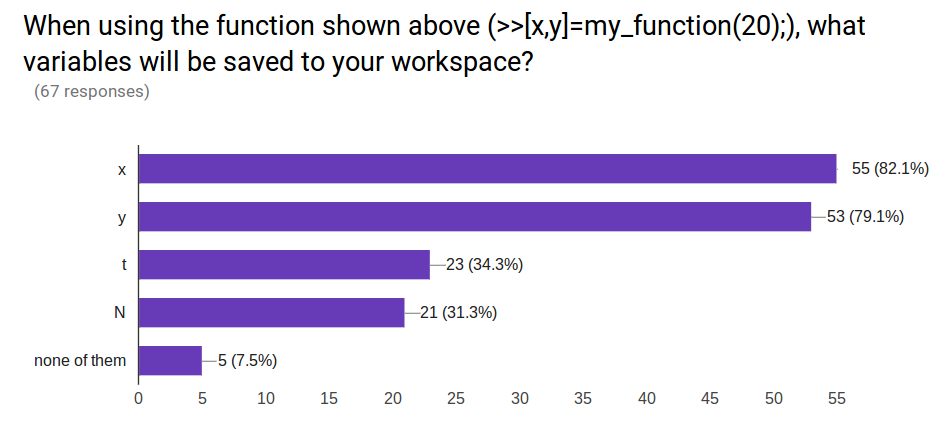
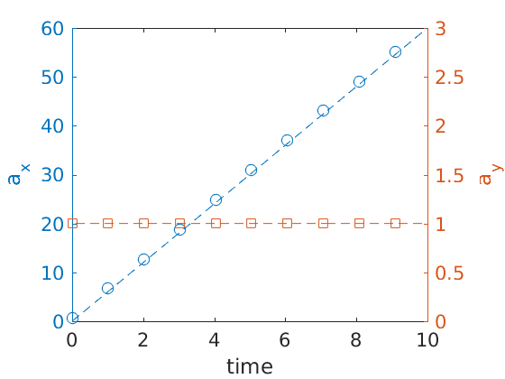
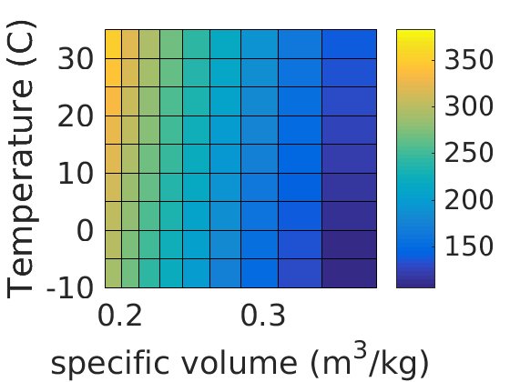

```octave
%plot --format svg
```

## Questions from last class

When you execute the given function 

my_function.m:

```matlab
function [x,y] = my_function(max_time)
    N=100;
    t=linspace(0,max_time,N);
    x=t.^2;
    y=2*t;
end
```

as 

```>> [x,y] = my_function(20);```

What variables are saved to your workspace?



How do you write a help description for a function?


 
How to keep our forked ME3255S page up to date with the original
pretty tired this morning

How do I use the Github Desktop?

whats your favorite football team?

Will UConn's github get updated to the newest version of github?
As u said in class trail and error is the best way of learning.

I believe the % is the same as matlab where it de-links your code into text

Does the @ symbol designate a pointer? 

Given the change of air pressure as altitude increases, how fast would a frisbee have to travel (and spin) to hit an airplane?

What is a gui?


could you go over a nested for loop example

Can't seem to get this function to produce any graph and am not sure why

When are these google forms due?

how do I create a new function using Github on my desktop?

Can you explain the first question more in class?

What is the meaning of life?

Should I just know how or what these topics are or will we learn them in the future?


```octave
f =@(x) x.^2


```

    f = 
    
        @(x)x.^2


```octave
f([1:2:10])
f(4)
```

    ans =
    
         1     9    25    49    81
    
    
    ans =
    
        16


```octave
% nested for loop example
for i = [1:6]
    for j = [1:3]
        fprintf('i=%i and j=%i\n',i,j)
    end
end
        
```

    i=1 and j=1
    i=1 and j=2
    i=1 and j=3
    i=2 and j=1
    i=2 and j=2
    i=2 and j=3
    i=3 and j=1
    i=3 and j=2
    i=3 and j=3
    i=4 and j=1
    i=4 and j=2
    i=4 and j=3
    i=5 and j=1
    i=5 and j=2
    i=5 and j=3
    i=6 and j=1
    i=6 and j=2
    i=6 and j=3


# From last class 


```octave
help my_function
```

    Help documentation of "my_function"
      This function computes the velocity in the x- and y-directions given
      three vectors of position in x- and y-directions as a function of time
      x = x-position
      y = y-position
      t = time
      output
      vx = velocity in x-direction
      vy = velocity in y-direction


```octave
help my_caller
```

    Help documentation of "my_caller"
      This function computes the acceleration in the x- and y-directions given
      three vectors of position in x- and y-directions as a function of time
      x = x-position
      y = y-position
      t = time
      output
      ax = acceleration in x-direction
      ay = acceleration in y-direction


```octave
t=linspace(0,10,100)'; 
x=t.^3; % vx = 3*t^2
y=t.^2/2;  % vy = t
[vx,vy]=my_function(x,y,t);
[ax,ay]=my_caller(x,y,t);
yyaxis left
plot(t(1:10:end),ax(1:10:end),'o',t,6*t)
ylabel('a_{x}')
yyaxis right
plot(t(1:10:end),ay(1:10:end),'s',t, 1*t./t)
ylabel('a_{y}')
xlabel('time')
axis([0,10,0,3])
```





```octave
diff_match_dims(x,t)
```

    Undefined function 'diff_match_dims' for input arguments of type 'double'.
    

# Good coding habits
## naming folders and files

[Stanford file naming best practices](https://library.stanford.edu/research/data-management-services/data-best-practices/best-practices-file-naming)

1. Include information to distinguish file name e.g. project name, objective of function, name/initials, type of data, conditions, version of file, 
2. if using dates, use YYYYMMDD, so the computer organizes by year, then month, then day
3. avoid special characters e.g. !, #, \$, ...
4. avoid using spaces if not necessary, some programs consider a space as a break in code use dashes `-` or underscores `_` or CamelCase

## Commenting your code

Its important to comment your code to mention what a variable's units are, what the function is supposed to do, etc. 


```octave
function i=code(j)
    % Example of bad variable names and bad function name
    for w=1:j
        i(w)=w;
    end
end
```

    Error: Function definitions are not permitted in this context.
    


```octave
help code
```

    code not found.
    
    Use the Help browser search field to search the documentation, or
    type "help help" for help command options, such as help for methods.


## Choose variable names that describe the variable


```octave
function count_vector=counting_function(max_value)
    % Good variable names and better help documentation
    % 
    % counting function creates a vector from 1 to max_value where each index, i, is 
    % stored in each vector spot
    for i=1:max_value
        count_vector(i)=i; % set each element in count_vector to i
    end
end      
```


```octave
help counting_function
```

    'counting_function' is a command-line function
    
     Good variable names and better help documentation
     
     counting function creates a vector from 1 to max_value where each index, i, is 
     stored in each vector spot
    
    
    Additional help for built-in functions and operators is
    available in the online version of the manual.  Use the command
    'doc <topic>' to search the manual index.
    
    Help and information about Octave is also available on the WWW
    at http://www.octave.org and via the help@octave.org
    mailing list.


## Putting it all together

1. Clone your homework_1 to your computer
2. open Matlab (cli, jupyter or gui)
3. Change working directory to homework_1 *e.g.* Windows:`cd('C:\Users\rcc02007\Documents\Github\homework_1')`, Mac: `cd('/Users/rcc02007/Documents/Github/homework_1')`
4. You have already created your first script `setdefaults.m` (if not see lecture_4)
5. Run `>> setdefaults.m`
6. Create a new m-file called nitrogen_pressure.m
7. Create a function based upon the ideal gas law for nitrogen, Pv=RT
    1. R=0.2968 kJ/(kg-K)
    2. inputs to function are v (specific volume m^3/kg), and T, temperature (K)
    3. output is P, pressure (kPa)
8. Once the function works, commit the change to the repository (add a message, like 'added file nitrogen_pressure.m'
9. After file is 'committed', 'push' the changes to your github account

for the command-line git user, this is steps 8 and 9:
1. `$ git add *`
2. `$ git commit -m 'added file nitrogen_pressure.m'`
3. `$ git push -u origin master
    Username for 'https://github.uconn.edu':rcc02007 <enter>
    Password for 'https://rcc02007@github.uconn.edu': `
   

Now, use this function to plot the range of pressures that a pressure vessel would experience if it is 1000 gallons (3.79 m^3) with 10-20 kg of Nitrogen and temperatures range from -10 to 35 degrees C. 

```matlab
v=0.379/linspace(50,20,10);
T=273.15+linspace(-10,35,10);
[v_grid,T_grid]=meshgrid(v,T);
P = nitrogen_pressure(v,T);
pcolor(v_grid,T_grid,P)
```


```octave
setdefaults;
v=3.79./linspace(10,20,10);
T=273.15+linspace(-10,35,10);
[v_grid,T_grid]=meshgrid(v,T);
P = nitrogen_pressure(v_grid,T_grid);
pcolor(v_grid,T_grid-273.15,P-100)
xlabel('specific volume (m^3/kg)')
ylabel('Temperature (C)')
%zlabel('Pressure (kPa)')

%colormap winter
%colormap summer
%colormap jet
colorbar()
```





```octave

```
