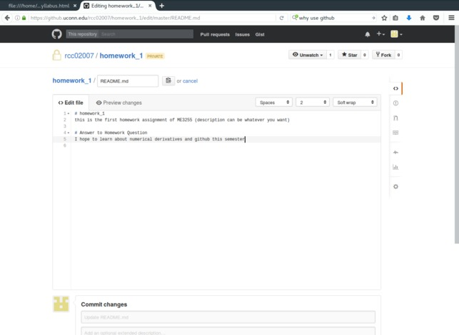

# Homework #1
## due 9/15/17

1. The first assignment is to fork the course syllabus and assignment. 

    a. Sign into your UConn github account via
    [github.uconn.edu](https://github.uconn.edu/). 

    b. Go to
    [https://github.uconn.edu/rcc02007/ME3255S2017.git](https://github.uconn.edu/rcc02007/ME3255S2017.git)
    and watch the repository. 

    c. Fork the repository to create your own version of the syllabus and assignments. 

2. The next assignment is to create your own repository named '01_ME3255_repo'.
    
    a. (if you signed out) Sign into your UConn github account via
    [github.uconn.edu](https://github.uconn.edu/). 

    b. Follow these steps to create your own repository named `01_ME3255_repo`:

        i. Click the +-sign and choose 'New repository'
        
  \

        ii. In the 'Repository name' enter '01_ME3255_repo'. Add a description. Make it
        private. Then check the box 'Initialize this repository with a README'. 

  \

        iii. Now you are in your repo. Click on the README.md file and then click the
        pencil to edit it. 

  \

        iv. Add a header with a `#` and type `# Answer to Homework Question`. Under this
        line answer this question: What do you hope to learn this semester?

  \

        v. At bottom of page, click 'Commit changes'.

  \

        vi. Verify that your README.md file has been updated. Then copy the HTTPS clone
        URL on the right of the page. 

  \

        vii. Paste this into the Homework #1 Google form reponse.
        [https://goo.gl/forms/b3YrBuFxZaXTYV5s1](https://goo.gl/forms/b3YrBuFxZaXTYV5s1)

  \

        viii. Click on the gear for "Settings" then "Collaborators" on the left menu. Add
        `rcc02007` (Ryan C. Cooper) and `zhs15101` (Zhiqiang Shen) as a collaborators. 

3. Use a script to create a variable called `A_66`, where every element is the product
of the two indices from 1 to 6 e.g. A_66(3,2)=6 and A_66(4,4)=16. Calculate the mean and
standard deviation of the values in A_66. 

4. Copy the data in
[US_energy_by_sector.csv](https://github.uconn.edu/rcc02007/ME3255F2017/blob/master/03_Intro%20to%20matlab-octave/US_energy_by_sector.csv)
to a file in you working directory in Matlab/Octave. Add these two plots to your
01_ME3255_repo with a heading of `#Problem 4`

    a. Plot the US energy consumption from 1949 to 2016 for "Total Energy Consumed by the
    Residential Sector" and "Total Energy Consumed by the Transportation Sector" in trillions
    of Btu's. 

    b. Plot the cumulative US energy consumption from 1949 to 2016 for "Total Energy Consumed by the
    Residential Sector" and "Total Energy Consumed by the Transportation Sector" in quintillions
    of Btu's (1 quintillion = 10$^6$ trillion). The cumulative energy is the area under
    the curve in part a from 1949 to a given year. 

5. In this part, you will modify the function presented in lecture `freefall.m`. In
lecture, the function required an input of `N` to divide the 12 second solution into
N-steps. Here, modify the input so that you can specify two inputs, step size-`h`, and
timespan-`timespan`. 

    a. Plot a comparison between calculated velocities v(t) for timesteps of h=0.1, 1, and
    5 sec from 0 to 30 seconds.

    b. Save the script that created the comparison plot as 'freefall_comparison.m' and the
    figure as figure01.png (use command `> print(figure01.png)`)

    c. Save your work to a folder called 'problem_3' and add it to the '01_ME3255_repo'
    repository

6. In this part we will create functions that calculate velocity and acceleration in 3D
based upon x,y,z-coordinates and time. 

    a. Create a function that takes four vectors as input, x,y,z,t,(where x,y,z are
    coordinate positions in meters) and its output are three vectors [vx,vy,vz] which are
    velocity components in m/s.

    b. Create a function that takes four vectors as input, x,y,z,t,(where x,y,z are
    coordinate positions in meters) and its output are three aectors [ax,ay,az] which are
    acceleration components in m/s$^2$.
