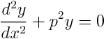
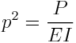
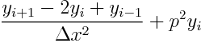
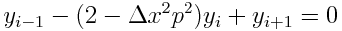

# Homework #4
## final commit due 11/2/17 by 11:59pm

*Include all work as either an m-file script, m-file function, or example code included
with \`\`\` and document your code in the README.md file*

### P1-2 Due 10/26

1. Create a new github repository called '04_linear_algebra'. 

    a. Add rcc02007 and zhs15101 as collaborators.

    b. Clone the repository to your computer.

    c. Submit clone repo link to
    [https://goo.gl/forms/gFNxhNM4qJJKj8hE3](https://goo.gl/forms/gFNxhNM4qJJKj8hE3)

**2\.** Create the  4x4 and 5x5 [Hilbert matrix](https://en.wikipedia.org/wiki/Hilbert_matrix) as H. Include the following results in your
README before 10/26 by midnight:

  a. What are the 2-norm, frobenius-norm, 1-norm and infinity-norm of the 4x4 and 5x5
  Hilbert matrices?

  b. What are the 2-norm, frobenius-norm, 1-norm and infinity-norm of the 4x4 and 5x5
  inverse Hilbert matrices?

  c. What are the condition numbers for the 2-norm, frobenius-norm, 1-norm and
  infinity-norm of the 4x4 and 5x5 Hilbert matrices?

### P3-4 Due 10/30

**3\.** Create a Cholesky factorization function called `chol_tridiag.m` that takes 2 vectors
as inputs and calculates the Cholseky factorization of a tridiagonal matrix. The output
should be 2 vectors, the diagonal and the off-diagonal vector of the Cholesky matrix. 

  ```[d,u]=chol_tridiag(e,f);```

**4\.** Use the output from `chol_tridiag.m` to create a forward substitution and
back-substitution function called `solve_tridiag.m` that provides the solution of
Ax=b given the vectors from the output of [d,u]=lu_tridiag(e,f). *Note: do not use
the backslash solver `\`, create an algebraic solution*

  ```x=solve_tridiag(d,u,b);```


**5\.** Create the stiffness matrix for the 4-mass system shown above
for cases a-c. Calculate the condition of the stiffness matrices. What is the expected error
when calculating the displacements of the 4 masses? Include the analysis and results in your README.

  a. K1=K2=K3=K4=1000 N/m
  
  b. K1=K3=K4=1000 N/m, K2=1000e12 N/m

  c. K1=K3=K4=1000 N/m, K2=1000e-12 N/m

**6\.** Use `chol_tridiag.m` and `solve_tridiag.m` to solve for the displacements of hanging
  masses 1-4 shown above in 5a-c, if all masses are 1 kg.


**7\.** In the system shown above, determine the three differential equations for the position
of masses 1, 2, and 3. Solve for the vibrational modes of the spring-mass system if k1=10
N/m, k2=k3=20 N/m, and k4=10 N/m. The masses are m1=1 kg, m2=2 kg and m3=4 kg. Create a
function, `mass_spring_vibrate.m` that outputs the vibration modes and natural frequencies based upon the
parameters, k1, k2, k3, and k4.  

**8\.** The curvature of a slender column subject to an axial load P can be
modeled by 


$\frac{d^{2}y}{dx^{2}} + p^{2} y = 0$



where $p^{2} = \frac{P}{EI}$ 

where E = the modulus of elasticity, and I = the moment of inertia of the cross section
about its neutral axis.  

This model can be converted into an eigenvalue problem by
substituting a centered finite-difference approximation for the second derivative to give
$\frac{y_{i+1} -2y_{i} + y_{i-1} }{\Delta x^{2}}+ p^{2} y_{i}$ 



where i = a node located at a position along the rod’s interior, and $\Delta x$ = the
spacing between nodes. This equation can be expressed as $y_{i-1} - (2 - \Delta x^{2}
p^{2} )y_{i} +y_{i+1} = 0$  Writing this equation for a series of interior nodes along the
axis of the column yields a homogeneous system of equations. (See 13.10 for 4
interior-node example)

Determine the eigenvalues for a 5-segment (4-interior nodes), 6-segment (5-interior
nodes), and 10-segment (9-interior nodes). Using the modulus and moment of inertia of a
pole for pole-vaulting (
[http://people.bath.ac.uk/taf21/sports_whole.htm](http://people.bath.ac.uk/taf21/sports_whole.htm))
E=76E9 Pa, I=4E-8 m^4, and L= 5m. 

Include a table in the `README.md` that shows the following results:
What are the largest and smallest loads in the beam based upon the different shapes? How many eigenvalues are
there? 

```
| # of segments | largest load (N) | smallest load (N) | # of eigenvalues |
| --- | --- | --- | --- |
| 5 | ... | ... | ... |
| 6 | ... | ... | ... |
| 10 | ... | ... | ... |
```

If the segment length approaches 0, how many eigenvalues would there be?
