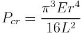
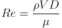

# Homework #5
## due 11/17 by 11:59pm


### Problem 1 due 11/9

**1\.** Create a new github repository called '05_curve_fitting'.

a. Add rcc02007 and zhs15101 as collaborators.

b. Clone the repository to your computer.


**2\.** Create a least-squares function called `least_squares.m` that accepts a Z-matrix and
dependent variable y as input and returns the vector of best-fit constants, a, the
best-fit function evaluated at each point $f(x_{i})$, and the coefficient of
determination, r2. 

```matlab
[a,fx,r2]=least_squares(Z,y);
```

Test your function on the sets of data in script `problem_2_data.m` and show that the
following functions are the best fit lines. Report the coefficient of determination in your README. 

a. y=0.3745+0.98644x+0.84564/x

b. y= 22.47-1.36x+0.28x^2

c. y=4.0046e^(-1.5x)+2.9213e^(-0.3x)+1.5647e^(-0.05x)

d. y=0.99sin(t)+0.5sin(3t)

**3\.** Load the data from the [class dart
experiment](https://github.com/cooperrc/stats_and_linear_regression/blob/master/compiled_data.csv). 
Show your work in a script with filename `dart_statistics.m` in your repository.

a. Which user (0-32) was the most accurate dart thrower e.g. mean(x)+mean(y) was closest to 0 cm?

b. Which user (0-32) was the most precise dart thrower e.g. std(x)+std(y) was closest to 0 cm?

**4\.** 100 steel rods are going to be used to support a 1000 kg structure. The
rods will buckle when the load in any rod exceeds the [critical buckling
load](https://en.wikipedia.org/wiki/Euler%27s_critical_load)

$P_{cr}=\frac{\pi^3 Er^4}{16L^2}$


where E=200e9 Pa, r=0.01 m +/-0.001 m, and L is the length of the rod which can only be
controlled to 1% tolerance. Create a Monte
Carlo model `buckle_monte_carlo.m` that predicts the mean and standard deviation of the buckling load for 100
samples with normally distributed dimensions r and L. 

`[mean_buckle_load,std_buckle_load]=buckle_monte_carlo(E,r_mean,r_std,L_mean,L_std)`

a. What is the mean_buckle_load and std_buckle_load for L=5 m?

b. What length, L, should the beams be so that only 2.5% will reach the critical buckling
load?

**5\.**  The drag coefficient for spheres such as sporting balls is known to vary as a
function of the Reynolds number Re, a dimensionless number that gives a measure of the
ratio of inertial forces to viscous forces:

$Re = \frac{\rho V D}{\mu}$


where ρ= the fluid’s density (kg/m3), V= its velocity (m/s), D= diameter (m), and μ=
dynamic viscosity (N⋅s/m2). The
following table provides values for a smooth spherical ball:

|Re (x1e-4) | C_D |
|---|---|
|2 | 0.52|
|5.8| 0.52|
|16.8| 0.52 |
|27.2|0.5|
|29.9|0.49 |
|33.9|0.44|
|36.3 | 0.18|
|40| 0.074 |
|46|0.067 |
|60|0.08 |
|100| 0.12|
|200| 0.16|
|400| 0.19|

a. Create a function `sphere_drag.m` that outputs the drag coefficient based on the given
table and an input Reynolds number using a spline interpolation of either linear
('linear'),
piecewise cubic ('pchip'), or continuous cubic spline('spline'):

`[Cd_out]=sphere_drag(Re_in,spline_type)`

b. Use the following physical constants to plot the drag force vs velocity for a baseball:
ρ= 1.3 kg/m3, V= 4 - 40 (m/s), D= 23.5 cm, and μ=1.78e-5 Pa-s. Plot all three
interpolation methods on a single plot. Show the plot in your README.

**6\.** Evaluate the integral of the following function:


a. analytically

b. with 1-point Gauss quadrature

c. with 2-point Gauss quadrature

d. with 3-point Gauss quadrature

e. include the results in a table in your README

|method|value|error|
|---|---|---|
|analytical| ... | 0%|
|1 Gauss point | ... | ..% |
|... | ... | ... |


