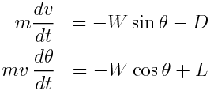
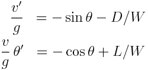
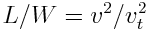
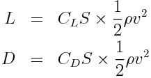
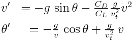
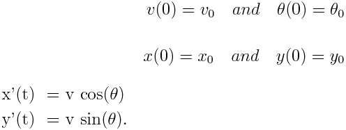
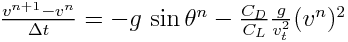
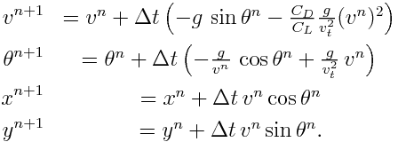

# Homework #6
## due 12/5 by 11:59pm

### Problem 1 due 11/30

**1\.** Create a new github repository called '06_initial_value_ode'.

a. Add rcc02007 and zhs15101 as collaborators.

b. Clone the repository to your computer.

**2\.** Solve the initial value problem with y(0)=1,

y'=-y

a. analytically

b. with Euler's method

c. with Heun's predictor-corrector approach

**3\.** Solve the initial value problem with y(0)=1, y'(0)=0

y''+9y=0

a. analytically

b. with Euler's method

c. with Heun's predictor-corrector approach

**4\.** Solve the freefall problem for x(t), given cd=0.25 kg/m, m=60 kg, from t=0-12 s,
given x(0)=100 m, v(0)=0 m/s

v'=g - cd/m v*v

a. analytically

b. with Euler's method

c. with Heun's predictor-corrector approach

### Paper airplane  Mini-design challenge 
[phugoid
models in Python](http://nbviewer.jupyter.org/github/numerical-mooc/numerical-mooc/blob/master/lessons/01_phugoid/01_03_PhugoidFullModel.ipynb)

**5\.** 

Using a phugoid model, write a function and script to analyze the flight of a paper airplane.

Use primes to
denote the time derivatives and divide through by the weight:

Ratio of lift to weight is known from the trim
 conditions  and also from the definitions of lift and drag, 

  
 
we see that L/D=C_L/C_D. The system of equations can be re-written:

 

To visualize the flight trajectories predicted by this model, we integrate the spatial
coordinates. The position of the glider on a vertical plane will be designated by
coordinates (x, y) with respect to an inertial frame of reference, and are obtained
from:

Augmenting our original two differential equations by the two equations above, we have a
system of four first-order differential equations to solve. We will use a time-stepping
approach, like in the previous lesson. To do so, we do need *initial values* for every
unknown:

where we are now using a superscript $n$ to indicate the $n$-th value in the time
iterations. The first differential equation, for example, gives:

The full system of equations discretized with Euler's method is:

*  Assume L/D of 5.2 (a value close to measurements in [Feng et al. 2009](./feng et al 2009-paper_airplane.pdf))
*  For the trim velocity, v_t=5.5 m/s.

**a\.** Create the ordinary differential equation function that outputs: v', theta', x', and y'
as the function `dy=phugoid_ode(t,y)`, where `y=[v,theta,x,y]'`

**b\.** Plot the position of the airplane over 20 seconds if the initial height is y(0)=2 m,
initial position is x(0)=0 m, initial velocity is v(0)=10 m/s, and initial angle,
theta(0)=0 rad. 
  
  **i\.** Use an Euler approximation with timesteps of 0.1 s and 0.01 s.

  **ii\.** Use ode23 
  
  **iii\.** Include the three plots on a single graph in your README.

**c\.** Group assignment for **Extra Credit**. Determine the optimal initial angle and initial speed to
launch the paper airplane to maximize distance traveled. You can solve the path of the
flight any way you like and you can work with up to three colleagues. 

Submit your github repository solution to the following Google form:

[https://goo.gl/forms/QpINqnnEhMceqCy02](https://goo.gl/forms/QpINqnnEhMceqCy02)

Initial judging by Prof. Cooper will be based upon clarity of solution (e.g. documents, files, results in README)

The top groups will be distributed to the class to be voted on

**Good Luck!**

