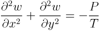
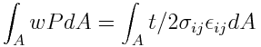
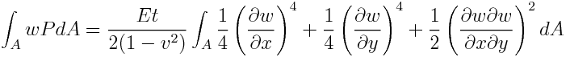
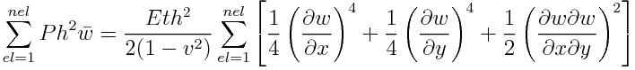
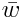
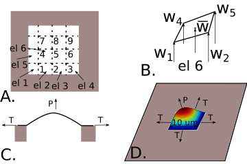

# ME 3255 Final Project
## Designing a graphene pressure sensor

[grading rubric](./rubric.md)


In this final project, you and your team mates will design a graphene pressure sensor.
Graphene is a single-layer of carbon atoms arranged in a hexagonal lattice. Graphene films
have a thickness of 0.3 nm, Young's modulus of 1 TPa, and Poisson's ratio of 0.31. The
film has no bending stiffness so the shape of the membrane under a given pressure, P, with
a pretension, T is given by:

 (1)

This equation assumes you know both the applied pressure and tension in the membrane, but
the tension will be a function of the applied pressure, assuming there is no initial
pretension. We will use an energy balance to solve the nonlinear relation between tension
and pressure. 

 (2)

 (3)

Where w(x,y) is the displacement of the membrane at a given point, (x,y), and the integral
is over the entire of area of the membrane, A. We can rewrite this exact integral as a
summation over the elements, as such.

 (4)

Where,  is the average w of the four nodes in the element, and
the summation goes from 1 to the number of elements, nel. 

In this design problem, we will solve for
the tension and deflection of a square membrane, as seen in figure 2. 



*Figure 2*. Square membrane design with sides of 10 um. 2A demonstrates the node and element
numbering for 9 interior nodes and 16 elements. 2B shows element 6 and its nodal
displacments along with the aveerage displacement as the red point. 2C shows a
cross-section of the force-balance for the square membrane window and 2D shows an
isometric view of the membrane displacement solution and force-balance. 

**a\.** Create a central finite difference approximation of the gradient with 3-by-3 interior nodes of w
for the given membrane solution in terms of P and T. `[w]=membrane_solution3(T,P);` The
output `w` should be a vector, but the solution represents a 2D data set w(x,y). 

**b\.** Solve for w given a pressure, P=0.001 MPa and tension, T=0.006 uN. Plot the result with
`surf(X,Y,W)` where X, Y, and W are the x-, y-, and z-coordinates of each point on the
membrane from 0-10um. 

**c\.** Create a general central finite difference approximation of the gradient with
n-by-n interior nodes of w
for the given membrane solution in terms of P and T. `[w]=membrane_solution(T,P,n);` The
output `w` should be a vector, but the solution represents a 2D data set w(x,y). 

**d\.** Solve for w given a pressure, P=0.001 MPa and tension, T=0.006 uN with 10 interior
nodes. Plot the result with `surf(X,Y,W)` where X, Y, and W are the x-, y-, and
z-coordinates of each point on the membrane from 0-10um. Include the graph in your README.

**e\.** Create a function `SE_diff` that calculates the difference in strain energy (right hand side Eq.
4) and work done by pressure (left hand side Eq. 4) for n-by-n elements. 

`[pw_se,w]=SE_diff(T,P,n)`

Use the solution from part **c** to calculate w, then do a numerical integral over the
elements to calculate work done and strain energy.

**f\.** Use a root-finding method to calculate the tension in the membrane given a
pressure, P=0.001 MPa, and n=[20:5:40] interior nodes. 

Show that the error in tension is decreasing with a table:

```
|number of nodes|Tension (uN)| rel. error|
|---|---|---|
|20|0.08| n/a|
|25|0.006|0.5%|
|30|0.006|0.3%|
|40|0.006|0.2%|
```


**g\.** Plot the Pressure vs maximum deflection (P (y-axis) vs max(w) (x-axis)) for
P=linspace(0.001,0.01,10). Use a root-finding method to determine tension, T, at each
pressure. Use a cubic best-fit to find A, where, P(x)=A*dw^3. State how
many interior nodes were used for the graph. Plot the data and best-fit curve in your
README.

**h\.[Bonus 5 pts]** Show that the constant A is converging as the number of nodes is
increased (Similar table to **f**). 

**i\.[Bonus 10 pts]** If the square membrane sides are always equal, but have a tolerance of 0.1\%, what
should the depth of the sensor be if 2.5% of the sensors won't hit the bottom given a
maximum pressure of 0.01 MPa. 
